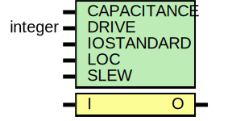

# Entity: OBUF

- **File**: OBUF.v
## Diagram

## Generics

| Generic name | Type    | Value       | Description |
| ------------ | ------- | ----------- | ----------- |
| CAPACITANCE  |         | "DONT_CARE" |             |
| DRIVE        | integer | 12          |             |
| IOSTANDARD   |         | "DEFAULT"   |             |
| LOC          |         | " UNPLACED" |             |
| SLEW         |         | "SLOW"      |             |
## Ports

| Port name | Direction | Type | Description |
| --------- | --------- | ---- | ----------- |
| O         | output    |      |             |
| I         | input     |      |             |
## Signals

| Name | Type | Description                |
| ---- | ---- | -------------------------- |
| GTS  | wire | Note, uses globals, ugly!  |
