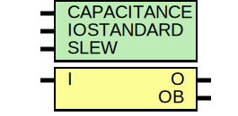

# Entity: OBUFDS

- **File**: OBUFDS.v
## Diagram

## Description

D

## Generics

| Generic name | Type | Value       | Description |
| ------------ | ---- | ----------- | ----------- |
| CAPACITANCE  |      | "DONT_CARE" |             |
| IOSTANDARD   |      | "DEFAULT"   |             |
| SLEW         |      | "SLOW"      |             |
## Ports

| Port name | Direction | Type | Description |
| --------- | --------- | ---- | ----------- |
| I         | input     |      |             |
| O         | output    |      |             |
| OB        | output    |      |             |
