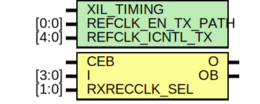

# Entity: OBUFDS_GTE3_ADV

- **File**: OBUFDS_GTE3_ADV.v
## Diagram

## Generics

| Generic name      | Type  | Value      | Description |
| ----------------- | ----- | ---------- | ----------- |
| XIL_TIMING        |       | "UNPLACED" | Simprim     |
| REFCLK_EN_TX_PATH | [0:0] | 1'b0       |             |
| REFCLK_ICNTL_TX   | [4:0] | 5'b00000   |             |
## Ports

| Port name    | Direction | Type  | Description |
| ------------ | --------- | ----- | ----------- |
| O            | output    |       |             |
| OB           | output    |       |             |
| CEB          | input     |       |             |
| I            | input     | [3:0] |             |
| RXRECCLK_SEL | input     | [1:0] |             |
