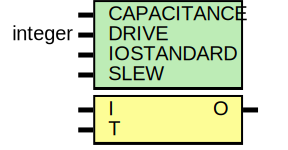

# Entity: OBUFT

- **File**: OBUFT.v
## Diagram

## Generics

| Generic name | Type    | Value       | Description |
| ------------ | ------- | ----------- | ----------- |
| CAPACITANCE  |         | "DONT_CARE" |             |
| DRIVE        | integer | 12          |             |
| IOSTANDARD   |         | "DEFAULT"   |             |
| SLEW         |         | "FAST"      |             |
## Ports

| Port name | Direction | Type | Description |
| --------- | --------- | ---- | ----------- |
| O         | output    |      |             |
| I         | input     |      |             |
|  T        | input     |      |             |
