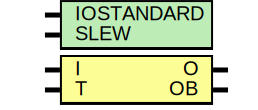

# Entity: OBUFTDS

- **File**: OBUFTDS.v
## Diagram

## Generics

| Generic name | Type | Value | Description |
| ------------ | ---- | ----- | ----------- |
| IOSTANDARD   |      | 0     |             |
| SLEW         |      | 0     |             |
## Ports

| Port name | Direction | Type | Description     |
| --------- | --------- | ---- | --------------- |
| I         | input     |      | input           |
| T         | input     |      | tristate signal |
| O         | output    |      | output          |
| OB        | output    |      | output_bar      |
