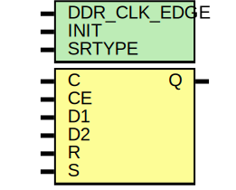

# Entity: ODDR

- **File**: ODDR.v
## Diagram

## Description

WARNING: ONLY SAME EDGE SUPPORTED FOR NOW*/
D1,D2 sampled on rising edge of C 

## Generics

| Generic name | Type | Value | Description          |
| ------------ | ---- | ----- | -------------------- |
| DDR_CLK_EDGE |      | 0     | clock recovery mode  |
| INIT         |      | 0     | Q init value         |
| SRTYPE       |      | 0     | "SYNC", "ASYNC"      |
## Ports

| Port name | Direction | Type | Description                              |
| --------- | --------- | ---- | ---------------------------------------- |
| C         | input     |      | Clock input                              |
| CE        | input     |      | Clock enable input                       |
| D1        | input     |      | Data input1                              |
| D2        | input     |      | Data input2                              |
| R         | input     |      | Reset (depends on SRTYPE)                |
| S         | input     |      | Active high asynchronous pin             |
| Q         | output    |      | Data Output that connects to the IOB pad |
## Signals

| Name   | Type | Description |
| ------ | ---- | ----------- |
| Q1     | reg  |             |
| Q2     | reg  |             |
| Q2_reg | reg  |             |
## Processes
- unnamed: ( @ (posedge C or posedge R) )
  - **Type:** always
 **Description**
Generate different logic based on parameters Only doing same edge and async reset for now    
- unnamed: ( @ (posedge C or posedge R) )
  - **Type:** always
- unnamed: ( @ (negedge C or posedge R) )
  - **Type:** always
