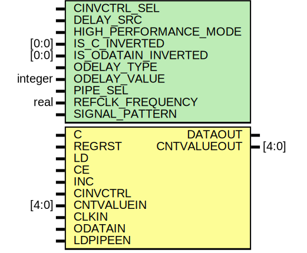

# Entity: ODELAYE2

- **File**: ODELAYE2.v
## Diagram

## Description

#

## Generics

| Generic name          | Type    | Value     | Description |
| --------------------- | ------- | --------- | ----------- |
| CINVCTRL_SEL          |         | "FALSE"   |             |
| DELAY_SRC             |         | "ODATAIN" |             |
| HIGH_PERFORMANCE_MODE |         | "FALSE"   |             |
| IS_C_INVERTED         | [0:0]   | 1'b0      |             |
| IS_ODATAIN_INVERTED   | [0:0]   | 1'b0      |             |
| ODELAY_TYPE           |         | "FIXED"   |             |
| ODELAY_VALUE          | integer | 0         |             |
| PIPE_SEL              |         | "FALSE"   |             |
| REFCLK_FREQUENCY      | real    | 200.0     |             |
| SIGNAL_PATTERN        |         | "DATA"    |             |
## Ports

| Port name   | Direction | Type  | Description                                     |
| ----------- | --------- | ----- | ----------------------------------------------- |
| C           | input     |       | clock for VARIABLE, VAR_LOAD,VAR_LOAD_PIPE mode |
| REGRST      | input     |       | reset pipeline reg to all zeroes                |
| LD          | input     |       | loads programmed values depending on "mode"     |
| CE          | input     |       | enable encrement/decrement function             |
| INC         | input     |       | increment/decrement tap delays                  |
| CINVCTRL    | input     |       | dynamically inverts clock polarity              |
| CNTVALUEIN  | input     | [4:0] | input value from FPGA logic                     |
| CLKIN       | input     |       | clk from I/O clock mux??                        |
| ODATAIN     | input     |       | data from OSERDESE2 output                      |
| DATAOUT     | output    |       | delayed data to pin                             |
| LDPIPEEN    | input     |       | enables pipeline reg??                          |
| CNTVALUEOUT | output    | [4:0] | current value for FPGA logic                    |
