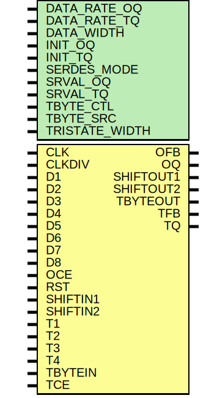

# Entity: OSERDESE2

- **File**: OSERDESE2.v
## Diagram

## Description

W

## Generics

| Generic name   | Type | Value | Description |
| -------------- | ---- | ----- | ----------- |
| DATA_RATE_OQ   |      | 0     |             |
| DATA_RATE_TQ   |      | 0     |             |
| DATA_WIDTH     |      | 0     |             |
| INIT_OQ        |      | 0     |             |
| INIT_TQ        |      | 0     |             |
| SERDES_MODE    |      | 0     |             |
| SRVAL_OQ       |      | 0     |             |
| SRVAL_TQ       |      | 0     |             |
| TBYTE_CTL      |      | 0     |             |
| TBYTE_SRC      |      | 0     |             |
| TRISTATE_WIDTH |      | 0     |             |
## Ports

| Port name | Direction | Type | Description                              |
| --------- | --------- | ---- | ---------------------------------------- |
| OFB       | output    |      | output feedback port                     |
| OQ        | output    |      | data output port, D1 appears first       |
| SHIFTOUT1 | output    |      | connect to shift in of master            |
| SHIFTOUT2 | output    |      | connect to shift in of master            |
| TBYTEOUT  | output    |      | byte group tristate output to IOB        |
| TFB       | output    |      | 3-state control output for ODELAYE2      |
| TQ        | output    |      | 3-state control output                   |
| CLK       | input     |      | high speed shift out clock               |
| CLKDIV    | input     |      | low speed clock (/4 for example)         |
| D1        | input     |      | first bit to shift out                   |
| D2        | input     |      |                                          |
| D3        | input     |      |                                          |
| D4        | input     |      |                                          |
| D5        | input     |      |                                          |
| D6        | input     |      |                                          |
| D7        | input     |      |                                          |
| D8        | input     |      |                                          |
| OCE       | input     |      | active high clock enable for datapath    |
| RST       | input     |      | async reset, all output flops driven low |
| SHIFTIN1  | input     |      | connect to shift out of other            |
| SHIFTIN2  | input     |      | connect to shift out of other            |
| T1        | input     |      | parallel 3-state signals                 |
| T2        | input     |      | ??why 4??                                |
| T3        | input     |      |                                          |
| T4        | input     |      |                                          |
| TBYTEIN   | input     |      | byte group tristate input                |
| TCE       | input     |      | active high clock enable for 3-state     |
## Signals

| Name          | Type      | Description                                                      |
| ------------- | --------- | ---------------------------------------------------------------- |
| state         | reg [2:0] | Statemachine                                                     |
| buffer        | reg [7:0] |                                                                  |
| clkdiv_sample | reg [1:0] |                                                                  |
| even          | reg [3:0] |                                                                  |
| odd           | reg [3:0] |                                                                  |
| load_parallel | wire      | shift on second consective clk rising edge that clkdi_sample==0  |
## Processes
- unnamed: ( @ (posedge CLKDIV) )
  - **Type:** always
 **Description**
parallel sample 
- unnamed: ( @ (negedge CLK) )
  - **Type:** always
 **Description**
sample clkdiv 
- unnamed: ( @ (posedge CLK) )
  - **Type:** always
- unnamed: ( @ (posedge CLK) )
  - **Type:** always
