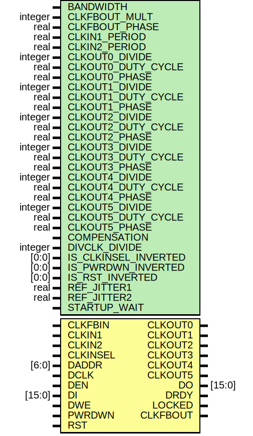

# Entity: PLLE2_ADV

- **File**: PLLE2_ADV.v
## Diagram

## Description

 verilator lint_off STMTDLY */
 verilator lint_off WIDTH */

## Generics

| Generic name         | Type    | Value       | Description |
| -------------------- | ------- | ----------- | ----------- |
| BANDWIDTH            |         | "OPTIMIZED" |             |
| CLKFBOUT_MULT        | integer | 5           |             |
| CLKFBOUT_PHASE       | real    | 0.000       |             |
| CLKIN1_PERIOD        | real    | 0.000       |             |
| CLKIN2_PERIOD        | real    | 0.000       |             |
| CLKOUT0_DIVIDE       | integer | 1           |             |
| CLKOUT0_DUTY_CYCLE   | real    | 0.500       |             |
| CLKOUT0_PHASE        | real    | 0.000       |             |
| CLKOUT1_DIVIDE       | integer | 1           |             |
| CLKOUT1_DUTY_CYCLE   | real    | 0.500       |             |
| CLKOUT1_PHASE        | real    | 0.000       |             |
| CLKOUT2_DIVIDE       | integer | 1           |             |
| CLKOUT2_DUTY_CYCLE   | real    | 0.500       |             |
| CLKOUT2_PHASE        | real    | 0.000       |             |
| CLKOUT3_DIVIDE       | integer | 1           |             |
| CLKOUT3_DUTY_CYCLE   | real    | 0.500       |             |
| CLKOUT3_PHASE        | real    | 0.000       |             |
| CLKOUT4_DIVIDE       | integer | 1           |             |
| CLKOUT4_DUTY_CYCLE   | real    | 0.500       |             |
| CLKOUT4_PHASE        | real    | 0.000       |             |
| CLKOUT5_DIVIDE       | integer | 1           |             |
| CLKOUT5_DUTY_CYCLE   | real    | 0.500       |             |
| CLKOUT5_PHASE        | real    | 0.000       |             |
| COMPENSATION         |         | "ZHOLD"     |             |
| DIVCLK_DIVIDE        | integer | 1           |             |
| IS_CLKINSEL_INVERTED | [0:0]   | 1'b0        |             |
| IS_PWRDWN_INVERTED   | [0:0]   | 1'b0        |             |
| IS_RST_INVERTED      | [0:0]   | 1'b0        |             |
| REF_JITTER1          | real    | 0.010       |             |
| REF_JITTER2          | real    | 0.010       |             |
| STARTUP_WAIT         |         | "FALSE"     |             |
## Ports

| Port name | Direction | Type   | Description |
| --------- | --------- | ------ | ----------- |
| CLKOUT0   | output    |        |             |
| CLKOUT1   | output    |        |             |
| CLKOUT2   | output    |        |             |
| CLKOUT3   | output    |        |             |
| CLKOUT4   | output    |        |             |
| CLKOUT5   | output    |        |             |
| DO        | output    | [15:0] |             |
| DRDY      | output    |        |             |
| LOCKED    | output    |        |             |
| CLKFBOUT  | output    |        |             |
| CLKFBIN   | input     |        |             |
| CLKIN1    | input     |        |             |
| CLKIN2    | input     |        |             |
| CLKINSEL  | input     |        |             |
| DADDR     | input     | [6:0]  |             |
| DCLK      | input     |        |             |
| DEN       | input     |        |             |
| DI        | input     | [15:0] |             |
| DWE       | input     |        |             |
| PWRDWN    | input     |        |             |
| RST       | input     |        |             |
## Signals

| Name            | Type               | Description                                                                                                                                                                                              |
| --------------- | ------------------ | -------------------------------------------------------------------------------------------------------------------------------------------------------------------------------------------------------- |
| POR             | reg                | ######################################################################## # POR ######################################################################## ugly POR reset                                   |
| reset           | wire               | async reset                                                                                                                                                                                              |
| j               | integer            | ######################################################################## # CLOCK MULTIPLIER ######################################################################## TODO: implement  DIVCLK_DIVIDE   |
| delay           | reg [2*phases-1:0] |                                                                                                                                                                                                          |
| clk_comb        | reg [(phases)-1:0] |                                                                                                                                                                                                          |
| vco_clk         | reg                |                                                                                                                                                                                                          |
| k               | integer            |                                                                                                                                                                                                          |
| DIVCFG          | wire [3:0]         | ############## #DIVIDERS ##############                                                                                                                                                                  |
| CLKOUT_DIV      | wire [5:0]         |                                                                                                                                                                                                          |
| CLKOUT_DIV_LOCK | reg [5:0]          |                                                                                                                                                                                                          |
| CLKOUT0         | reg                | ############## #SUB PHASE DELAY ##############                                                                                                                                                           |
| CLKOUT1         | reg                |                                                                                                                                                                                                          |
| CLKOUT2         | reg                |                                                                                                                                                                                                          |
| CLKOUT3         | reg                |                                                                                                                                                                                                          |
| CLKOUT4         | reg                |                                                                                                                                                                                                          |
| CLKOUT5         | reg                |                                                                                                                                                                                                          |
| lock_counter    | reg [LCW-1:0]      |                                                                                                                                                                                                          |
## Constants

| Name       | Type | Value                         | Description                                                                          |
| ---------- | ---- | ----------------------------- | ------------------------------------------------------------------------------------ |
| VCO_PERIOD | real | CLKFBOUT_MULT                 | #LOCAL DERIVED PARAMETERS                                                            |
| CLK0_DELAY | real | VCO_PERIOD * CLKOUT0_DIVIDE   |                                                                                      |
| CLK1_DELAY | real | VCO_PERIOD * CLKOUT1_DIVIDE   |                                                                                      |
| CLK2_DELAY | real | VCO_PERIOD * CLKOUT2_DIVIDE   |                                                                                      |
| CLK3_DELAY | real | VCO_PERIOD * CLKOUT3_DIVIDE   |                                                                                      |
| CLK4_DELAY | real | VCO_PERIOD * CLKOUT4_DIVIDE   |                                                                                      |
| CLK5_DELAY | real | VCO_PERIOD * CLKOUT5_DIVIDE   |                                                                                      |
| phases     |      | CLKFBOUT_MULT / DIVCLK_DIVIDE |                                                                                      |
| LCW        |      | 4                             | ########################### #SANITY CHECK LOCK COUNTER ############################  |
## Processes
- unnamed: ( @ (CLKIN1 or reset) )
  - **Type:** always
- unnamed: ( @ (delay) )
  - **Type:** always
- unnamed: ( @* )
  - **Type:** always
- unnamed: ( @ (posedge (CLKIN1 & vco_clk) or negedge (CLKIN1&~vco_clk)) )
  - **Type:** always
- unnamed: ( @ (CLKOUT_DIV_LOCK) )
  - **Type:** always
- unnamed: ( @ (posedge CLKIN1 or posedge reset) )
  - **Type:** always
- unnamed: ( @ (divcfg[3:0]) )
  - **Type:** always
 **Description**
 ###################  # Decode divcfg  ################### 
- unnamed: ( @ (posedge clkin or posedge reset) )
  - **Type:** always
- unnamed: ( @ (posedge clkin or posedge reset) )
  - **Type:** always
