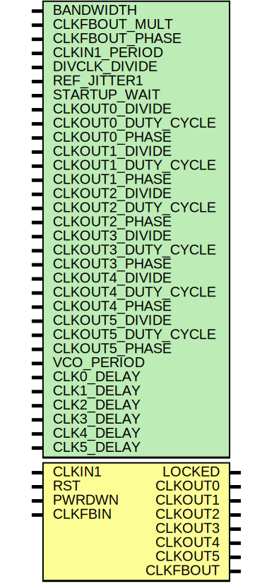

# Entity: PLLE2_BASE

- **File**: PLLE2_BASE.v
## Diagram

## Generics

| Generic name       | Type | Value                       | Description                |
| ------------------ | ---- | --------------------------- | -------------------------- |
| BANDWIDTH          |      | 0                           |                            |
| CLKFBOUT_MULT      |      | 1                           |                            |
| CLKFBOUT_PHASE     |      | 0                           |                            |
| CLKIN1_PERIOD      |      | 10                          |                            |
| DIVCLK_DIVIDE      |      | 1                           |                            |
| REF_JITTER1        |      | 0                           |                            |
| STARTUP_WAIT       |      | 0                           |                            |
| CLKOUT0_DIVIDE     |      | 1                           |                            |
| CLKOUT0_DUTY_CYCLE |      | 0.5                         |                            |
| CLKOUT0_PHASE      |      | 0                           |                            |
| CLKOUT1_DIVIDE     |      | 1                           |                            |
| CLKOUT1_DUTY_CYCLE |      | 0.5                         |                            |
| CLKOUT1_PHASE      |      | 0                           |                            |
| CLKOUT2_DIVIDE     |      | 1                           |                            |
| CLKOUT2_DUTY_CYCLE |      | 0.5                         |                            |
| CLKOUT2_PHASE      |      | 0                           |                            |
| CLKOUT3_DIVIDE     |      | 1                           |                            |
| CLKOUT3_DUTY_CYCLE |      | 0.5                         |                            |
| CLKOUT3_PHASE      |      | 0                           |                            |
| CLKOUT4_DIVIDE     |      | 1                           |                            |
| CLKOUT4_DUTY_CYCLE |      | 0.5                         |                            |
| CLKOUT4_PHASE      |      | 0                           |                            |
| CLKOUT5_DIVIDE     |      | 1                           |                            |
| CLKOUT5_DUTY_CYCLE |      | 0.5                         |                            |
| CLKOUT5_PHASE      |      | 0                           |                            |
| VCO_PERIOD         |      | CLKFBOUT_MULT               | #LOCAL DERIVED PARAMETERS  |
| CLK0_DELAY         |      | VCO_PERIOD * CLKOUT0_DIVIDE |                            |
| CLK1_DELAY         |      | VCO_PERIOD * CLKOUT1_DIVIDE |                            |
| CLK2_DELAY         |      | VCO_PERIOD * CLKOUT2_DIVIDE |                            |
| CLK3_DELAY         |      | VCO_PERIOD * CLKOUT3_DIVIDE |                            |
| CLK4_DELAY         |      | VCO_PERIOD * CLKOUT4_DIVIDE |                            |
| CLK5_DELAY         |      | VCO_PERIOD * CLKOUT5_DIVIDE |                            |
## Ports

| Port name | Direction | Type | Description |
| --------- | --------- | ---- | ----------- |
| CLKIN1    | input     |      | inputs      |
| RST       | input     |      |             |
| PWRDWN    | input     |      |             |
| CLKFBIN   | input     |      |             |
| LOCKED    | output    |      | outputs     |
| CLKOUT0   | output    |      |             |
| CLKOUT1   | output    |      |             |
| CLKOUT2   | output    |      |             |
| CLKOUT3   | output    |      |             |
| CLKOUT4   | output    |      |             |
| CLKOUT5   | output    |      |             |
| CLKFBOUT  | output    |      |             |
## Signals

| Name       | Type       | Description                                 |
| ---------- | ---------- | ------------------------------------------- |
| vco_clk    | reg        | ############## #VCO  ##############         |
| DIVCFG     | wire [3:0] | ############## #DIVIDERS ##############     |
| CLKOUT_DIV | wire [5:0] |                                             |
| POR        | reg        | ugly POR reset                              |
| CLKOUT0    | reg        | ############## #PHASE DELAY ##############  |
| CLKOUT1    | reg        |                                             |
| CLKOUT2    | reg        |                                             |
| CLKOUT3    | reg        |                                             |
| CLKOUT4    | reg        |                                             |
| CLKOUT5    | reg        |                                             |
## Processes
- unnamed: (  )
  - **Type:** always
- unnamed: ( @ (CLKOUT_DIV) )
  - **Type:** always
