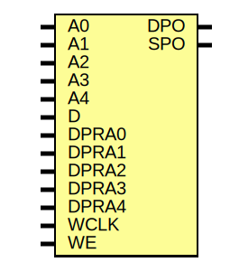

# Entity: RAM32X1D

- **File**: RAM32X1D.v
## Diagram

## Ports

| Port name | Direction | Type | Description |
| --------- | --------- | ---- | ----------- |
| A0        | input     |      | inputs      |
| A1        | input     |      |             |
| A2        | input     |      |             |
| A3        | input     |      |             |
| A4        | input     |      |             |
| D         | input     |      |             |
| DPRA0     | input     |      |             |
| DPRA1     | input     |      |             |
| DPRA2     | input     |      |             |
| DPRA3     | input     |      |             |
| DPRA4     | input     |      |             |
| WCLK      | input     |      |             |
| WE        | input     |      |             |
| DPO       | output    |      | outputs     |
| SPO       | output    |      |             |
