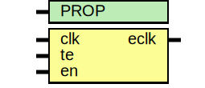

# Entity: asic_clkicgor

- **File**: asic_clkicgor.v
## Diagram

## Description

#############################################################################
# Function: Integrated "Or" Clock Gating Cell                               #
# Copyright: OH Project Authors. ALl rights Reserved.                       #
# License:  MIT (see LICENSE file in OH repository)                         #
#############################################################################

## Generics

| Generic name | Type | Value     | Description |
| ------------ | ---- | --------- | ----------- |
| PROP         |      | "DEFAULT" |             |
## Ports

| Port name | Direction | Type | Description          |
| --------- | --------- | ---- | -------------------- |
| clk       | input     |      | clock input          |
| te        | input     |      | test enable          |
| en        | input     |      | enable               |
| eclk      | output    |      | enabled clock output |
## Signals

| Name      | Type | Description |
| --------- | ---- | ----------- |
| en_stable | reg  |             |
## Processes
- unnamed: ( @ (clk or en or te) )
  - **Type:** always
