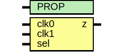

# Entity: asic_clkmux2

- **File**: asic_clkmux2.v
## Diagram

## Description

#############################################################################
# Function: 2:1 Clock Mux                                                   #
#############################################################################
# Author:   Andreas Olofsson                                                #
# License:  MIT (see LICENSE file in OH! repository)                        #
#############################################################################

## Generics

| Generic name | Type | Value     | Description |
| ------------ | ---- | --------- | ----------- |
| PROP         |      | "DEFAULT" |             |
## Ports

| Port name | Direction | Type | Description |
| --------- | --------- | ---- | ----------- |
| clk0      | input     |      |             |
| clk1      | input     |      |             |
| sel       | input     |      |             |
| z         | output    |      |             |
