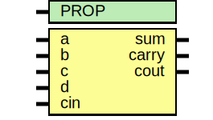

# Entity: asic_csa42

- **File**: asic_csa42.v
## Diagram

## Description

#############################################################################
# Function: Carry Save Adder (4:2) (aka 5:3)                                #
# Copyright: OH Project Authors. ALl rights Reserved.                       #
# License:  MIT (see LICENSE file in OH repository)                         #
#############################################################################

## Generics

| Generic name | Type | Value     | Description |
| ------------ | ---- | --------- | ----------- |
| PROP         |      | "DEFAULT" |             |
## Ports

| Port name | Direction | Type | Description |
| --------- | --------- | ---- | ----------- |
| a         | input     |      |             |
| b         | input     |      |             |
| c         | input     |      |             |
| d         | input     |      |             |
| cin       | input     |      |             |
| sum       | output    |      |             |
| carry     | output    |      |             |
| cout      | output    |      |             |
