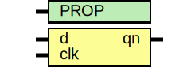

# Entity: asic_dffqn

- **File**: asic_dffqn.v
## Diagram

## Description

#############################################################################
# Function: Positive edge-triggered inverting static D-type flop-flop       #
# Copyright: OH Project Authors. ALl rights Reserved.                       #
# License:  MIT (see LICENSE file in OH repository)                         #
#############################################################################

## Generics

| Generic name | Type | Value     | Description |
| ------------ | ---- | --------- | ----------- |
| PROP         |      | "DEFAULT" |             |
## Ports

| Port name | Direction | Type | Description |
| --------- | --------- | ---- | ----------- |
| d         | input     |      |             |
| clk       | input     |      |             |
| qn        | output    |      |             |
## Processes
- unnamed: ( @ (posedge clk) )
  - **Type:** always
