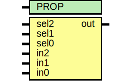

# Entity: asic_dmux3

- **File**: asic_dmux3.v
## Diagram

## Description

#############################################################################
# Function: 3:1 one hot mux                                                 #
#############################################################################
# Author:   Andreas Olofsson                                                #
# License:  MIT (see LICENSE file in OH! repository)                        #
#############################################################################

## Generics

| Generic name | Type | Value     | Description |
| ------------ | ---- | --------- | ----------- |
| PROP         |      | "DEFAULT" |             |
## Ports

| Port name | Direction | Type | Description |
| --------- | --------- | ---- | ----------- |
| sel2      | input     |      |             |
| sel1      | input     |      |             |
| sel0      | input     |      |             |
| in2       | input     |      |             |
| in1       | input     |      |             |
| in0       | input     |      |             |
| out       | output    |      |             |
