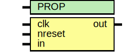

# Entity: asic_dsync

- **File**: asic_dsync.v
## Diagram

## Description

#############################################################################
# Function: Data Syncrhonizer                                               #
#############################################################################
# Author:   Andreas Olofsson                                                #
# License:  MIT (see LICENSE file in OH! repository)                        #
#############################################################################

## Generics

| Generic name | Type | Value     | Description |
| ------------ | ---- | --------- | ----------- |
| PROP         |      | "DEFAULT" |             |
## Ports

| Port name | Direction | Type | Description            |
| --------- | --------- | ---- | ---------------------- |
| clk       | input     |      | clock                  |
| nreset    | input     |      | async active low reset |
| in        | input     |      | input data             |
| out       | output    |      | synchronized data      |
## Signals

| Name      | Type               | Description |
| --------- | ------------------ | ----------- |
| sync_pipe | reg [SYNCPIPE-1:0] |             |
## Constants

| Name     | Type | Value | Description |
| -------- | ---- | ----- | ----------- |
| SYNCPIPE |      | 2     |             |
## Processes
- unnamed: ( @ (posedge clk or negedge nreset) )
  - **Type:** always
