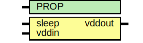

# Entity: asic_header

- **File**: asic_header.v
## Diagram

## Description

#############################################################################
# Function: Power supply header switch                                      #
#############################################################################
# Author:   Andreas Olofsson                                                #
# License:  MIT (see LICENSE file in OH! repository)                        #
#############################################################################

## Generics

| Generic name | Type | Value     | Description |
| ------------ | ---- | --------- | ----------- |
| PROP         |      | "DEFAULT" |             |
## Ports

| Port name | Direction | Type | Description         |
| --------- | --------- | ---- | ------------------- |
| sleep     | input     |      | 1 = disabled vdd    |
| vddin     | input     |      | input supply        |
| vddout    | output    |      | gated output supply |
