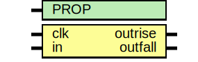

# Entity: asic_iddr

- **File**: asic_iddr.v
## Diagram

## Description

#############################################################################
# Function: Dual data rate input buffer                                     #
# Copyright: OH Project Authors. All rights Reserved.                       #
# License:  MIT (see LICENSE file in OH repository)                         #
#############################################################################

## Generics

| Generic name | Type | Value     | Description |
| ------------ | ---- | --------- | ----------- |
| PROP         |      | "DEFAULT" |             |
## Ports

| Port name | Direction | Type | Description                               |
| --------- | --------- | ---- | ----------------------------------------- |
| clk       | input     |      | clock                                     |
| in        | input     |      | data input sampled on both edges of clock |
| outrise   | output    |      | rising edge sample                        |
| outfall   | output    |      | falling edge sample                       |
## Signals

| Name   | Type | Description      |
| ------ | ---- | ---------------- |
| inrise | reg  |  Posedge Sample  |
## Processes
- unnamed: ( @ (negedge clk) )
  - **Type:** always
 **Description**
 Negedge Sample 
- unnamed: ( @ (posedge clk) )
  - **Type:** always
- unnamed: ( @ (clk or inrise) )
  - **Type:** always
 **Description**
 Posedge Latch (for hold) 
