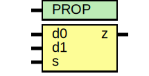

# Entity: asic_muxi2

- **File**: asic_muxi2.v
## Diagram

## Description

#############################################################################
# Function: 2-Input Inverting Mux                                           #
#                                                                           #
# Copyright: OH Project Authors. ALl rights Reserved.                       #
# License:  MIT (see LICENSE file in OH repository)                         #
#############################################################################

## Generics

| Generic name | Type | Value     | Description |
| ------------ | ---- | --------- | ----------- |
| PROP         |      | "DEFAULT" |             |
## Ports

| Port name | Direction | Type | Description |
| --------- | --------- | ---- | ----------- |
| d0        | input     |      |             |
| d1        | input     |      |             |
| s         | input     |      |             |
| z         | output    |      |             |
