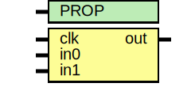

# Entity: asic_oddr

- **File**: asic_oddr.v
## Diagram

## Description

#############################################################################
# Function: Dual data rate output buffer                                    #
# Copyright: OH Project Authors. All rights Reserved.                       #
# License:  MIT (see LICENSE file in OH repository)                         #
#############################################################################

## Generics

| Generic name | Type | Value     | Description |
| ------------ | ---- | --------- | ----------- |
| PROP         |      | "DEFAULT" |             |
## Ports

| Port name | Direction | Type | Description           |
| --------- | --------- | ---- | --------------------- |
| clk       | input     |      | clock input           |
| in0       | input     |      | data for clk=0        |
| in1       | input     |      | data for clk=1        |
| out       | output    |      | dual data rate output |
## Signals

| Name   | Type | Description                  |
| ------ | ---- | ---------------------------- |
| in1_sh | reg  | Making in1 stable for clk=1  |
## Processes
- unnamed: ( @ (clk or in1) )
  - **Type:** always
