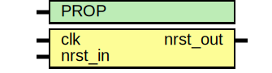

# Entity: asic_rsync

- **File**: asic_rsync.v
## Diagram

## Description

#############################################################################
# Function:  Reset synchronizer                                             #
             (async assert, sync deassert)                                  #
# Copyright: OH Project Authors. All rights Reserved.                       #
# License:   MIT (see LICENSE file in OH repository)                        #
#############################################################################

## Generics

| Generic name | Type | Value     | Description |
| ------------ | ---- | --------- | ----------- |
| PROP         |      | "DEFAULT" |             |
## Ports

| Port name | Direction | Type | Description |
| --------- | --------- | ---- | ----------- |
| clk       | input     |      |             |
| nrst_in   | input     |      |             |
| nrst_out  | output    |      |             |
## Signals

| Name      | Type               | Description |
| --------- | ------------------ | ----------- |
| sync_pipe | reg [SYNCPIPE-1:0] |             |
## Constants

| Name     | Type | Value | Description |
| -------- | ---- | ----- | ----------- |
| SYNCPIPE |      | 2     |             |
## Processes
- unnamed: ( @ (posedge clk or negedge nrst_in) )
  - **Type:** always
