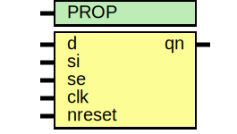

# Entity: asic_sdffrqn

- **File**: asic_sdffrqn.v
## Diagram

## Description

#############################################################################
# Function:  Positive edge-triggered static inverting D-type flop-flop with #
             async active low reset and scan input                          #
# Copyright: OH Project Authors. ALl rights Reserved.                       #
# License:   MIT (see LICENSE file in OH repository)                        #
#############################################################################

## Generics

| Generic name | Type | Value     | Description |
| ------------ | ---- | --------- | ----------- |
| PROP         |      | "DEFAULT" |             |
## Ports

| Port name | Direction | Type | Description |
| --------- | --------- | ---- | ----------- |
| d         | input     |      |             |
| si        | input     |      |             |
| se        | input     |      |             |
| clk       | input     |      |             |
| nreset    | input     |      |             |
| qn        | output    |      |             |
## Processes
- unnamed: ( @ (posedge clk or negedge nreset) )
  - **Type:** always
