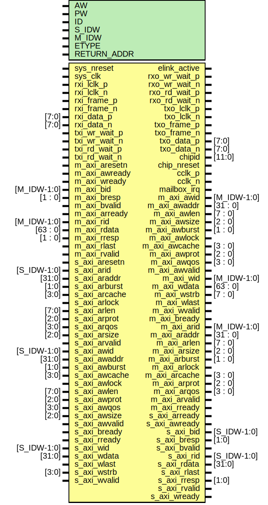

# Entity: axi_elink

- **File**: axi_elink.v
## Diagram

## Description

########################################################
 ELINK + AXI_SLAVE + AXI_MASTER
########################################################

## Generics

| Generic name | Type | Value     | Description             |
| ------------ | ---- | --------- | ----------------------- |
| AW           |      | 32        |  address width          |
| PW           |      | 2*AW+40   |  packet width           |
| ID           |      | 12'h810   |  addr[31:20] id         |
| S_IDW        |      | 12        |  ID width for S_AXI     |
| M_IDW        |      | 6         |  ID width for M_AXI     |
| ETYPE        |      | 0         |  board specific         |
| RETURN_ADDR  |      | undefined |                         |
## Ports

| Port name     | Direction | Type        | Description                           |
| ------------- | --------- | ----------- | ------------------------------------- |
| sys_nreset    | input     |             | active low async reset                |
| sys_clk       | input     |             | system clock for AXI                  |
| elink_active  | output    |             | link is active and ready              |
| rxi_lclk_p    | input     |             | rx clock input                        |
|    rxi_lclk_n | input     |             | rx clock input                        |
| rxi_frame_p   | input     |             | rx frame signal                       |
|   rxi_frame_n | input     |             | rx frame signal                       |
| rxi_data_p    | input     | [7:0]       | rx data                               |
|    rxi_data_n | input     | [7:0]       | rx data                               |
| rxo_wr_wait_p | output    |             | rx write pushback output              |
| rxo_wr_wait_n | output    |             | rx write pushback output              |
| rxo_rd_wait_p | output    |             | rx read pushback output               |
| rxo_rd_wait_n | output    |             | rx read pushback output               |
| txo_lclk_p    | output    |             | tx clock output                       |
| txo_lclk_n    | output    |             | tx clock output                       |
| txo_frame_p   | output    |             | tx frame signal                       |
| txo_frame_n   | output    |             | tx frame signal                       |
| txo_data_p    | output    | [7:0]       | tx data                               |
|    txo_data_n | output    | [7:0]       | tx data                               |
| txi_wr_wait_p | input     |             | tx write pushback input               |
| txi_wr_wait_n | input     |             | tx write pushback input               |
| txi_rd_wait_p | input     |             | tx read pushback input                |
| txi_rd_wait_n | input     |             | tx read pushback input                |
| chipid        | output    | [11:0]      | Epiphany id strap pins                |
| chip_nreset   | output    |             | Epiphany chip reset                   |
| cclk_p        | output    |             | Epiphany clock                        |
| cclk_n        | output    |             | Epiphany clock                        |
| mailbox_irq   | output    |             | mailbox not empty                     |
| m_axi_aresetn | input     |             | global reset singal.                  |
| m_axi_awid    | output    | [M_IDW-1:0] | write address ID                      |
| m_axi_awaddr  | output    | [31 : 0]    | master interface write address        |
| m_axi_awlen   | output    | [7 : 0]     | burst length.                         |
| m_axi_awsize  | output    | [2 : 0]     | burst size.                           |
| m_axi_awburst | output    | [1 : 0]     | burst type.                           |
| m_axi_awlock  | output    |             | lock type                             |
| m_axi_awcache | output    | [3 : 0]     | memory type.                          |
| m_axi_awprot  | output    | [2 : 0]     | protection type.                      |
| m_axi_awqos   | output    | [3 : 0]     | quality of service                    |
| m_axi_awvalid | output    |             | write address valid                   |
| m_axi_awready | input     |             | write address ready                   |
| m_axi_wid     | output    | [M_IDW-1:0] |                                       |
| m_axi_wdata   | output    | [63 : 0]    | master interface write data.          |
| m_axi_wstrb   | output    | [7 : 0]     | byte write strobes                    |
| m_axi_wlast   | output    |             | last transfer in a write burst.       |
| m_axi_wvalid  | output    |             | indicates data is ready to go         |
| m_axi_wready  | input     |             | slave is ready for data               |
| m_axi_bid     | input     | [M_IDW-1:0] |                                       |
| m_axi_bresp   | input     | [1 : 0]     | status of the write transaction.      |
| m_axi_bvalid  | input     |             | valid write response                  |
| m_axi_bready  | output    |             | master can accept write response.     |
| m_axi_arid    | output    | [M_IDW-1:0] | read address ID                       |
| m_axi_araddr  | output    | [31 : 0]    | initial address of a read burst       |
| m_axi_arlen   | output    | [7 : 0]     | burst length                          |
| m_axi_arsize  | output    | [2 : 0]     | burst size                            |
| m_axi_arburst | output    | [1 : 0]     | burst type                            |
| m_axi_arlock  | output    |             | lock type                             |
| m_axi_arcache | output    | [3 : 0]     | memory type                           |
| m_axi_arprot  | output    | [2 : 0]     | protection type                       |
| m_axi_arqos   | output    | [3 : 0]     | --                                    |
| m_axi_arvalid | output    |             | read address and control is valid     |
| m_axi_arready | input     |             | slave is ready to accept an address   |
| m_axi_rid     | input     | [M_IDW-1:0] |                                       |
| m_axi_rdata   | input     | [63 : 0]    | master read data                      |
| m_axi_rresp   | input     | [1 : 0]     | status of the read transfer           |
| m_axi_rlast   | input     |             | signals last transfer in a read burst |
| m_axi_rvalid  | input     |             | signaling the required read data      |
| m_axi_rready  | output    |             | master can accept the readback data   |
| s_axi_aresetn | input     |             | AXI slave                             |
| s_axi_arid    | input     | [S_IDW-1:0] | write address ID                      |
| s_axi_araddr  | input     | [31:0]      |                                       |
| s_axi_arburst | input     | [1:0]       |                                       |
| s_axi_arcache | input     | [3:0]       |                                       |
| s_axi_arlock  | input     |             |                                       |
| s_axi_arlen   | input     | [7:0]       |                                       |
| s_axi_arprot  | input     | [2:0]       |                                       |
| s_axi_arqos   | input     | [3:0]       |                                       |
| s_axi_arready | output    |             |                                       |
| s_axi_arsize  | input     | [2:0]       |                                       |
| s_axi_arvalid | input     |             |                                       |
| s_axi_awid    | input     | [S_IDW-1:0] | write address ID                      |
| s_axi_awaddr  | input     | [31:0]      |                                       |
| s_axi_awburst | input     | [1:0]       |                                       |
| s_axi_awcache | input     | [3:0]       |                                       |
| s_axi_awlock  | input     |             |                                       |
| s_axi_awlen   | input     | [7:0]       |                                       |
| s_axi_awprot  | input     | [2:0]       |                                       |
| s_axi_awqos   | input     | [3:0]       |                                       |
| s_axi_awsize  | input     | [2:0]       |                                       |
| s_axi_awvalid | input     |             |                                       |
| s_axi_awready | output    |             |                                       |
| s_axi_bid     | output    | [S_IDW-1:0] | write address ID                      |
| s_axi_bresp   | output    | [1:0]       |                                       |
| s_axi_bvalid  | output    |             |                                       |
| s_axi_bready  | input     |             |                                       |
| s_axi_rid     | output    | [S_IDW-1:0] | write address ID                      |
| s_axi_rdata   | output    | [31:0]      |                                       |
| s_axi_rlast   | output    |             |                                       |
| s_axi_rresp   | output    | [1:0]       |                                       |
| s_axi_rvalid  | output    |             |                                       |
| s_axi_rready  | input     |             |                                       |
| s_axi_wid     | input     | [S_IDW-1:0] | write address ID                      |
| s_axi_wdata   | input     | [31:0]      |                                       |
| s_axi_wlast   | input     |             |                                       |
| s_axi_wstrb   | input     | [3:0]       |                                       |
| s_axi_wvalid  | input     |             |                                       |
| s_axi_wready  | output    |             |                                       |
## Signals

| Name        | Type          | Description            |
| ----------- | ------------- | ---------------------- |
| rxrd_access | wire          | From elink of elink.v  |
| rxrd_packet | wire [PW-1:0] | From elink of elink.v  |
| rxrd_wait   | wire          | From emaxi of emaxi.v  |
| rxrr_access | wire          | From elink of elink.v  |
| rxrr_packet | wire [PW-1:0] | From elink of elink.v  |
| rxrr_wait   | wire          | From esaxi of esaxi.v  |
| rxwr_access | wire          | From elink of elink.v  |
| rxwr_packet | wire [PW-1:0] | From elink of elink.v  |
| rxwr_wait   | wire          | From emaxi of emaxi.v  |
| txrd_access | wire          | From esaxi of esaxi.v  |
| txrd_packet | wire [PW-1:0] | From esaxi of esaxi.v  |
| txrd_wait   | wire          | From elink of elink.v  |
| txrr_access | wire          | From emaxi of emaxi.v  |
| txrr_packet | wire [PW-1:0] | From emaxi of emaxi.v  |
| txrr_wait   | wire          | From elink of elink.v  |
| txwr_access | wire          | From esaxi of esaxi.v  |
| txwr_packet | wire [PW-1:0] | From esaxi of esaxi.v  |
| txwr_wait   | wire          | From elink of elink.v  |
