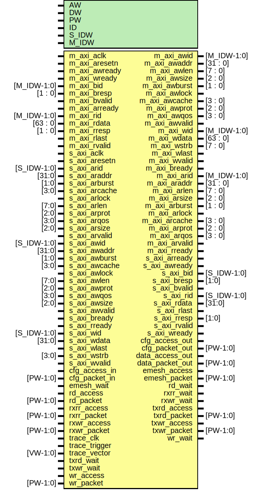

# Entity: axi_etrace

- **File**: axi_etrace.v
## Diagram

## Generics

| Generic name | Type | Value   | Description         |
| ------------ | ---- | ------- | ------------------- |
| AW           |      | 32      |                     |
| DW           |      | 32      |                     |
| PW           |      | 104     | packet width        |
| ID           |      | 12'h810 |                     |
| S_IDW        |      | 12      | ID width for S_AXI  |
| M_IDW        |      | 6       | ID width for M_AXI  |
## Ports

| Port name       | Direction | Type        | Description                                                                      |
| --------------- | --------- | ----------- | -------------------------------------------------------------------------------- |
| m_axi_aclk      | input     |             | ########################AXI MASTER INTERFACE ######################## clk+reset  |
| m_axi_aresetn   | input     |             | global reset singal.                                                             |
| m_axi_awid      | output    | [M_IDW-1:0] | write address ID                                                                 |
| m_axi_awaddr    | output    | [31 : 0]    | master interface write address                                                   |
| m_axi_awlen     | output    | [7 : 0]     | burst length.                                                                    |
| m_axi_awsize    | output    | [2 : 0]     | burst size.                                                                      |
| m_axi_awburst   | output    | [1 : 0]     | burst type.                                                                      |
| m_axi_awlock    | output    |             | lock type                                                                        |
| m_axi_awcache   | output    | [3 : 0]     | memory type.                                                                     |
| m_axi_awprot    | output    | [2 : 0]     | protection type.                                                                 |
| m_axi_awqos     | output    | [3 : 0]     | quality of service                                                               |
| m_axi_awvalid   | output    |             | write address valid                                                              |
| m_axi_awready   | input     |             | write address ready                                                              |
| m_axi_wid       | output    | [M_IDW-1:0] | Write data channel                                                               |
| m_axi_wdata     | output    | [63 : 0]    | master interface write data.                                                     |
| m_axi_wstrb     | output    | [7 : 0]     | byte write strobes                                                               |
| m_axi_wlast     | output    |             | last transfer in a write burst.                                                  |
| m_axi_wvalid    | output    |             | indicates data is ready to go                                                    |
| m_axi_wready    | input     |             | slave is ready for data                                                          |
| m_axi_bid       | input     | [M_IDW-1:0] | Write response channel                                                           |
| m_axi_bresp     | input     | [1 : 0]     | status of the write transaction.                                                 |
| m_axi_bvalid    | input     |             | valid write response                                                             |
| m_axi_bready    | output    |             | master can accept write response.                                                |
| m_axi_arid      | output    | [M_IDW-1:0] | read address ID                                                                  |
| m_axi_araddr    | output    | [31 : 0]    | initial address of a read burst                                                  |
| m_axi_arlen     | output    | [7 : 0]     | burst length                                                                     |
| m_axi_arsize    | output    | [2 : 0]     | burst size                                                                       |
| m_axi_arburst   | output    | [1 : 0]     | burst type                                                                       |
| m_axi_arlock    | output    |             | lock type                                                                        |
| m_axi_arcache   | output    | [3 : 0]     | memory type                                                                      |
| m_axi_arprot    | output    | [2 : 0]     | protection type                                                                  |
| m_axi_arqos     | output    | [3 : 0]     | --                                                                               |
| m_axi_arvalid   | output    |             | read address and control is valid                                                |
| m_axi_arready   | input     |             | slave is ready to accept an address                                              |
| m_axi_rid       | input     | [M_IDW-1:0] | Read data channel                                                                |
| m_axi_rdata     | input     | [63 : 0]    | master read data                                                                 |
| m_axi_rresp     | input     | [1 : 0]     | status of the read transfer                                                      |
| m_axi_rlast     | input     |             | signals last transfer in a read burst                                            |
| m_axi_rvalid    | input     |             | signaling the required read data                                                 |
| m_axi_rready    | output    |             | master can accept the readback data                                              |
| s_axi_aclk      | input     |             | ########################AXI SLAVE INTERFACE ######################## clk+reset   |
| s_axi_aresetn   | input     |             |                                                                                  |
| s_axi_arid      | input     | [S_IDW-1:0] | write address ID                                                                 |
| s_axi_araddr    | input     | [31:0]      |                                                                                  |
| s_axi_arburst   | input     | [1:0]       |                                                                                  |
| s_axi_arcache   | input     | [3:0]       |                                                                                  |
| s_axi_arlock    | input     |             |                                                                                  |
| s_axi_arlen     | input     | [7:0]       |                                                                                  |
| s_axi_arprot    | input     | [2:0]       |                                                                                  |
| s_axi_arqos     | input     | [3:0]       |                                                                                  |
| s_axi_arready   | output    |             |                                                                                  |
| s_axi_arsize    | input     | [2:0]       |                                                                                  |
| s_axi_arvalid   | input     |             |                                                                                  |
| s_axi_awid      | input     | [S_IDW-1:0] | write address ID                                                                 |
| s_axi_awaddr    | input     | [31:0]      |                                                                                  |
| s_axi_awburst   | input     | [1:0]       |                                                                                  |
| s_axi_awcache   | input     | [3:0]       |                                                                                  |
| s_axi_awlock    | input     |             |                                                                                  |
| s_axi_awlen     | input     | [7:0]       |                                                                                  |
| s_axi_awprot    | input     | [2:0]       |                                                                                  |
| s_axi_awqos     | input     | [3:0]       |                                                                                  |
| s_axi_awsize    | input     | [2:0]       |                                                                                  |
| s_axi_awvalid   | input     |             |                                                                                  |
| s_axi_awready   | output    |             |                                                                                  |
| s_axi_bid       | output    | [S_IDW-1:0] | write address ID                                                                 |
| s_axi_bresp     | output    | [1:0]       |                                                                                  |
| s_axi_bvalid    | output    |             |                                                                                  |
| s_axi_bready    | input     |             |                                                                                  |
| s_axi_rid       | output    | [S_IDW-1:0] | write address ID                                                                 |
| s_axi_rdata     | output    | [31:0]      |                                                                                  |
| s_axi_rlast     | output    |             |                                                                                  |
| s_axi_rresp     | output    | [1:0]       |                                                                                  |
| s_axi_rvalid    | output    |             |                                                                                  |
| s_axi_rready    | input     |             |                                                                                  |
| s_axi_wid       | input     | [S_IDW-1:0] | write address ID                                                                 |
| s_axi_wdata     | input     | [31:0]      |                                                                                  |
| s_axi_wlast     | input     |             |                                                                                  |
| s_axi_wstrb     | input     | [3:0]       |                                                                                  |
| s_axi_wvalid    | input     |             |                                                                                  |
| s_axi_wready    | output    |             |                                                                                  |
| cfg_access_in   | input     |             | To etrace of etrace.v                                                            |
| cfg_packet_in   | input     | [PW-1:0]    | To etrace of etrace.v                                                            |
| emesh_wait      | input     |             | To emesh_mux of emesh_mux.v                                                      |
| rd_access       | input     |             | To emesh_mux of emesh_mux.v                                                      |
| rd_packet       | input     | [PW-1:0]    | To emesh_mux of emesh_mux.v                                                      |
| rxrr_access     | input     |             | To esaxi of esaxi.v                                                              |
| rxrr_packet     | input     | [PW-1:0]    | To esaxi of esaxi.v                                                              |
| rxwr_access     | input     |             | To emaxi of emaxi.v                                                              |
| rxwr_packet     | input     | [PW-1:0]    | To emaxi of emaxi.v                                                              |
| trace_clk       | input     |             | To etrace of etrace.v                                                            |
| trace_trigger   | input     |             | To etrace of etrace.v                                                            |
| trace_vector    | input     | [VW-1:0]    | To etrace of etrace.v                                                            |
| txrd_wait       | input     |             | To esaxi of esaxi.v                                                              |
| txwr_wait       | input     |             | To esaxi of esaxi.v                                                              |
| wr_access       | input     |             | To emesh_mux of emesh_mux.v                                                      |
| wr_packet       | input     | [PW-1:0]    | To emesh_mux of emesh_mux.v                                                      |
| cfg_access_out  | output    |             | From etrace of etrace.v                                                          |
| cfg_packet_out  | output    | [PW-1:0]    | From etrace of etrace.v                                                          |
| data_access_out | output    |             | From etrace of etrace.v                                                          |
| data_packet_out | output    | [PW-1:0]    | From etrace of etrace.v                                                          |
| emesh_access    | output    |             | From emesh_mux of emesh_mux.v                                                    |
| emesh_packet    | output    | [PW-1:0]    | From emesh_mux of emesh_mux.v                                                    |
| rd_wait         | output    |             | From emesh_mux of emesh_mux.v                                                    |
| rxrr_wait       | output    |             | From esaxi of esaxi.v                                                            |
| rxwr_wait       | output    |             | From emaxi of emaxi.v                                                            |
| txrd_access     | output    |             | From esaxi of esaxi.v                                                            |
| txrd_packet     | output    | [PW-1:0]    | From esaxi of esaxi.v                                                            |
| txwr_access     | output    |             | From esaxi of esaxi.v                                                            |
| txwr_packet     | output    | [PW-1:0]    | From esaxi of esaxi.v                                                            |
| wr_wait         | output    |             | From emesh_mux of emesh_mux.v                                                    |
