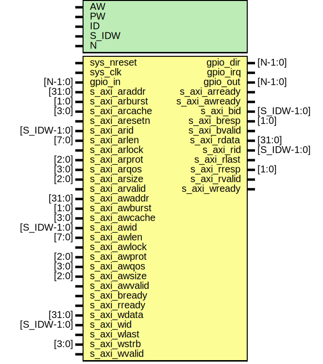

# Entity: axi_gpio

- **File**: axi_gpio.v
## Diagram

## Description

#############################################################################
# Purpose: AXI GPIO module                                                  #
#############################################################################
# Author:   Ola Jeppsson                                                    #
# SPDX-License-Identifier:     MIT                                          #
#############################################################################

## Generics

| Generic name | Type | Value   | Description           |
| ------------ | ---- | ------- | --------------------- |
| AW           |      | 32      |  address width        |
| PW           |      | 2*AW+40 |  packet width         |
| ID           |      | 12'h810 |  addr[31:20] id       |
| S_IDW        |      | 12      |  ID width for S_AXI   |
| N            |      | 24      |  number of gpio pins  |
## Ports

| Port name     | Direction | Type        | Description            |
| ------------- | --------- | ----------- | ---------------------- |
| sys_nreset    | input     |             | active low async reset |
| sys_clk       | input     |             | system clock for AXI   |
| gpio_in       | input     | [N-1:0]     | To gpio of gpio.v      |
| s_axi_araddr  | input     | [31:0]      | To esaxi of esaxi.v    |
| s_axi_arburst | input     | [1:0]       | To esaxi of esaxi.v    |
| s_axi_arcache | input     | [3:0]       | To esaxi of esaxi.v    |
| s_axi_aresetn | input     |             | To esaxi of esaxi.v    |
| s_axi_arid    | input     | [S_IDW-1:0] | To esaxi of esaxi.v    |
| s_axi_arlen   | input     | [7:0]       | To esaxi of esaxi.v    |
| s_axi_arlock  | input     |             | To esaxi of esaxi.v    |
| s_axi_arprot  | input     | [2:0]       | To esaxi of esaxi.v    |
| s_axi_arqos   | input     | [3:0]       | To esaxi of esaxi.v    |
| s_axi_arsize  | input     | [2:0]       | To esaxi of esaxi.v    |
| s_axi_arvalid | input     |             | To esaxi of esaxi.v    |
| s_axi_awaddr  | input     | [31:0]      | To esaxi of esaxi.v    |
| s_axi_awburst | input     | [1:0]       | To esaxi of esaxi.v    |
| s_axi_awcache | input     | [3:0]       | To esaxi of esaxi.v    |
| s_axi_awid    | input     | [S_IDW-1:0] | To esaxi of esaxi.v    |
| s_axi_awlen   | input     | [7:0]       | To esaxi of esaxi.v    |
| s_axi_awlock  | input     |             | To esaxi of esaxi.v    |
| s_axi_awprot  | input     | [2:0]       | To esaxi of esaxi.v    |
| s_axi_awqos   | input     | [3:0]       | To esaxi of esaxi.v    |
| s_axi_awsize  | input     | [2:0]       | To esaxi of esaxi.v    |
| s_axi_awvalid | input     |             | To esaxi of esaxi.v    |
| s_axi_bready  | input     |             | To esaxi of esaxi.v    |
| s_axi_rready  | input     |             | To esaxi of esaxi.v    |
| s_axi_wdata   | input     | [31:0]      | To esaxi of esaxi.v    |
| s_axi_wid     | input     | [S_IDW-1:0] | To esaxi of esaxi.v    |
| s_axi_wlast   | input     |             | To esaxi of esaxi.v    |
| s_axi_wstrb   | input     | [3:0]       | To esaxi of esaxi.v    |
| s_axi_wvalid  | input     |             | To esaxi of esaxi.v    |
| gpio_dir      | output    | [N-1:0]     | From gpio of gpio.v    |
| gpio_irq      | output    |             | From gpio of gpio.v    |
| gpio_out      | output    | [N-1:0]     | From gpio of gpio.v    |
| s_axi_arready | output    |             | From esaxi of esaxi.v  |
| s_axi_awready | output    |             | From esaxi of esaxi.v  |
| s_axi_bid     | output    | [S_IDW-1:0] | From esaxi of esaxi.v  |
| s_axi_bresp   | output    | [1:0]       | From esaxi of esaxi.v  |
| s_axi_bvalid  | output    |             | From esaxi of esaxi.v  |
| s_axi_rdata   | output    | [31:0]      | From esaxi of esaxi.v  |
| s_axi_rid     | output    | [S_IDW-1:0] | From esaxi of esaxi.v  |
| s_axi_rlast   | output    |             | From esaxi of esaxi.v  |
| s_axi_rresp   | output    | [1:0]       | From esaxi of esaxi.v  |
| s_axi_rvalid  | output    |             | From esaxi of esaxi.v  |
| s_axi_wready  | output    |             | From esaxi of esaxi.v  |
## Signals

| Name            | Type          | Description                                                                             |
| --------------- | ------------- | --------------------------------------------------------------------------------------- |
| s_wr_access     | wire          | ############################  HOST GENERATERD ############################ Slave Write  |
| s_wr_packet     | wire [PW-1:0] |                                                                                         |
| s_wr_wait       | wire          |                                                                                         |
| s_rd_access     | wire          | Slave Read Request                                                                      |
| s_rd_packet     | wire [PW-1:0] |                                                                                         |
| s_rd_wait       | wire          |                                                                                         |
| s_rr_access     | wire          | Slave Read Response                                                                     |
| s_rr_packet     | wire [PW-1:0] |                                                                                         |
| s_rr_wait       | wire          |                                                                                         |
| gpio_wait_out   | wire          |  End of automatics AUTOWIRE*/ AUTOREG*/                                                 |
| gpio_access_out | wire          |                                                                                         |
| gpio_packet_out | wire [PW-1:0] |                                                                                         |
| gpio_access_in  | wire          |                                                                                         |
| gpio_packet_in  | wire [PW-1:0] |                                                                                         |
| gpio_wait_in    | wire          |                                                                                         |
