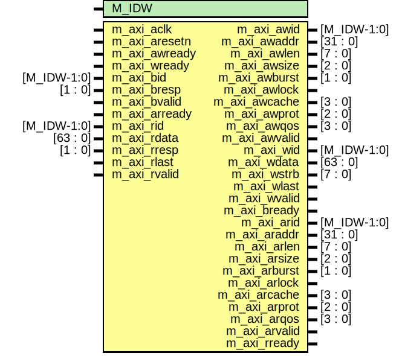

# Entity: aximaster_stub

- **File**: aximaster_stub.v
## Diagram

## Description

########################
AXI MASTER INTERFACE
########################

## Generics

| Generic name | Type | Value | Description |
| ------------ | ---- | ----- | ----------- |
| M_IDW        |      | 12    |             |
## Ports

| Port name     | Direction | Type        | Description                                 |
| ------------- | --------- | ----------- | ------------------------------------------- |
| m_axi_aclk    | input     |             | global clock signal.                        |
| m_axi_aresetn | input     |             | global reset singal.                        |
| m_axi_awid    | output    | [M_IDW-1:0] | write address ID                            |
| m_axi_awaddr  | output    | [31 : 0]    | master interface write address              |
| m_axi_awlen   | output    | [7 : 0]     | burst length.                               |
| m_axi_awsize  | output    | [2 : 0]     | burst size.                                 |
| m_axi_awburst | output    | [1 : 0]     | burst type.                                 |
| m_axi_awlock  | output    |             | lock type                                   |
| m_axi_awcache | output    | [3 : 0]     | memory type.                                |
| m_axi_awprot  | output    | [2 : 0]     | protection type.                            |
| m_axi_awqos   | output    | [3 : 0]     | quality of service                          |
| m_axi_awvalid | output    |             | write address valid                         |
| m_axi_awready | input     |             | write address ready                         |
| m_axi_wid     | output    | [M_IDW-1:0] | Write data channel                          |
| m_axi_wdata   | output    | [63 : 0]    | master interface write data.                |
| m_axi_wstrb   | output    | [7 : 0]     | byte write strobes                          |
| m_axi_wlast   | output    |             | indicates last transfer in a write burst.   |
| m_axi_wvalid  | output    |             | indicates data is ready to go               |
| m_axi_wready  | input     |             | indicates that the slave is ready for data  |
| m_axi_bid     | input     | [M_IDW-1:0] | Write response channel                      |
| m_axi_bresp   | input     | [1 : 0]     | status of the write transaction.            |
| m_axi_bvalid  | input     |             | channel is signaling a valid write response |
| m_axi_bready  | output    |             | master can accept write response.           |
| m_axi_arid    | output    | [M_IDW-1:0] | read address ID                             |
| m_axi_araddr  | output    | [31 : 0]    | initial address of a read burst             |
| m_axi_arlen   | output    | [7 : 0]     | burst length                                |
| m_axi_arsize  | output    | [2 : 0]     | burst size                                  |
| m_axi_arburst | output    | [1 : 0]     | burst type                                  |
| m_axi_arlock  | output    |             | lock type                                   |
| m_axi_arcache | output    | [3 : 0]     | memory type                                 |
| m_axi_arprot  | output    | [2 : 0]     | protection type                             |
| m_axi_arqos   | output    | [3 : 0]     |                                             |
| m_axi_arvalid | output    |             | valid read address and control information  |
| m_axi_arready | input     |             | slave is ready to accept an address         |
| m_axi_rid     | input     | [M_IDW-1:0] | Read data channel                           |
| m_axi_rdata   | input     | [63 : 0]    | master read data                            |
| m_axi_rresp   | input     | [1 : 0]     | status of the read transfer                 |
| m_axi_rlast   | input     |             | signals last transfer in a read burst       |
| m_axi_rvalid  | input     |             | signaling the required read data            |
| m_axi_rready  | output    |             | master can accept the readback data         |
