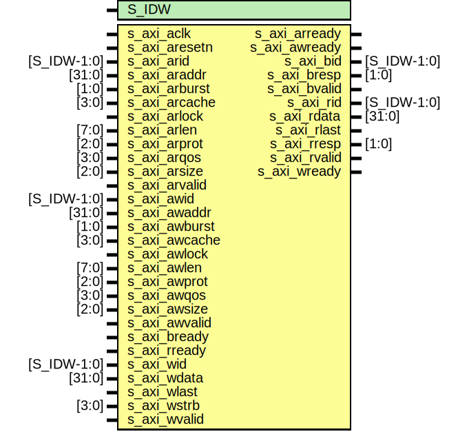

# Entity: axislave_stub

- **File**: axislave_stub.v
## Diagram

## Generics

| Generic name | Type | Value | Description |
| ------------ | ---- | ----- | ----------- |
| S_IDW        |      | 12    |             |
## Ports

| Port name     | Direction | Type        | Description                                                                                               |
| ------------- | --------- | ----------- | --------------------------------------------------------------------------------------------------------- |
| s_axi_aclk    | input     |             | ****************************/AXI slave interface        */ ****************************/ Clock and reset  |
| s_axi_aresetn | input     |             |                                                                                                           |
| s_axi_arid    | input     | [S_IDW-1:0] | write address ID                                                                                          |
| s_axi_araddr  | input     | [31:0]      |                                                                                                           |
| s_axi_arburst | input     | [1:0]       |                                                                                                           |
| s_axi_arcache | input     | [3:0]       |                                                                                                           |
| s_axi_arlock  | input     |             |                                                                                                           |
| s_axi_arlen   | input     | [7:0]       |                                                                                                           |
| s_axi_arprot  | input     | [2:0]       |                                                                                                           |
| s_axi_arqos   | input     | [3:0]       |                                                                                                           |
| s_axi_arready | output    |             |                                                                                                           |
| s_axi_arsize  | input     | [2:0]       |                                                                                                           |
| s_axi_arvalid | input     |             |                                                                                                           |
| s_axi_awid    | input     | [S_IDW-1:0] | write address ID                                                                                          |
| s_axi_awaddr  | input     | [31:0]      |                                                                                                           |
| s_axi_awburst | input     | [1:0]       |                                                                                                           |
| s_axi_awcache | input     | [3:0]       |                                                                                                           |
| s_axi_awlock  | input     |             |                                                                                                           |
| s_axi_awlen   | input     | [7:0]       |                                                                                                           |
| s_axi_awprot  | input     | [2:0]       |                                                                                                           |
| s_axi_awqos   | input     | [3:0]       |                                                                                                           |
| s_axi_awsize  | input     | [2:0]       |                                                                                                           |
| s_axi_awvalid | input     |             |                                                                                                           |
| s_axi_awready | output    |             |                                                                                                           |
| s_axi_bid     | output    | [S_IDW-1:0] | write address ID                                                                                          |
| s_axi_bresp   | output    | [1:0]       |                                                                                                           |
| s_axi_bvalid  | output    |             |                                                                                                           |
| s_axi_bready  | input     |             |                                                                                                           |
| s_axi_rid     | output    | [S_IDW-1:0] | write address ID                                                                                          |
| s_axi_rdata   | output    | [31:0]      |                                                                                                           |
| s_axi_rlast   | output    |             |                                                                                                           |
| s_axi_rresp   | output    | [1:0]       |                                                                                                           |
| s_axi_rvalid  | output    |             |                                                                                                           |
| s_axi_rready  | input     |             |                                                                                                           |
| s_axi_wid     | input     | [S_IDW-1:0] | write address ID                                                                                          |
| s_axi_wdata   | input     | [31:0]      |                                                                                                           |
| s_axi_wlast   | input     |             |                                                                                                           |
| s_axi_wstrb   | input     | [3:0]       |                                                                                                           |
| s_axi_wvalid  | input     |             |                                                                                                           |
| s_axi_wready  | output    |             |                                                                                                           |
