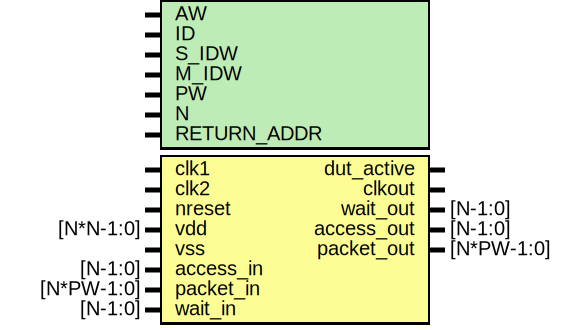

# Entity: dut

- **File**: dut_axi_elink.v
## Diagram

## Generics

| Generic name | Type | Value     | Description                                                                                                                                                         |
| ------------ | ---- | --------- | ------------------------------------------------------------------------------------------------------------------------------------------------------------------- |
| AW           |      | 32        | ########################################################################## # INTERFACE  ##########################################################################  |
| ID           |      | 12'h810   |                                                                                                                                                                     |
| S_IDW        |      | 12        |                                                                                                                                                                     |
| M_IDW        |      | 6         |                                                                                                                                                                     |
| PW           |      | 2*AW + 40 |                                                                                                                                                                     |
| N            |      | 1         |                                                                                                                                                                     |
| RETURN_ADDR  |      | undefined |                                                                                                                                                                     |
## Ports

| Port name  | Direction | Type       | Description                     |
| ---------- | --------- | ---------- | ------------------------------- |
| clk1       | input     |            |  axi return addr   clock,reset  |
| clk2       | input     |            |                                 |
| nreset     | input     |            |                                 |
| vdd        | input     | [N*N-1:0]  |                                 |
| vss        | input     |            |                                 |
| dut_active | output    |            |                                 |
| clkout     | output    |            |                                 |
| access_in  | input     | [N-1:0]    | Stimulus Driven Transaction     |
| packet_in  | input     | [N*PW-1:0] |                                 |
| wait_out   | output    | [N-1:0]    |                                 |
| access_out | output    | [N-1:0]    | DUT driven transaction          |
| packet_out | output    | [N*PW-1:0] |                                 |
| wait_in    | input     | [N-1:0]    |                                 |
## Signals

| Name              | Type             | Description                                                                                                                                                   |
| ----------------- | ---------------- | ------------------------------------------------------------------------------------------------------------------------------------------------------------- |
| mem_rd_wait       | wire             | ########################################################################## #BODY  ##########################################################################  |
| mem_wr_wait       | wire             |                                                                                                                                                               |
| mem_access        | wire             |                                                                                                                                                               |
| mem_packet        | wire [PW-1:0]    |                                                                                                                                                               |
| cclk_n            | wire             | From elink0 of axi_elink.v                                                                                                                                    |
| cclk_p            | wire             | From elink0 of axi_elink.v                                                                                                                                    |
| chip_nreset       | wire             | From elink0 of axi_elink.v                                                                                                                                    |
| chipid            | wire [11:0]      | From elink0 of axi_elink.v                                                                                                                                    |
| m_axi_araddr      | wire [31:0]      | From emaxi of emaxi.v                                                                                                                                         |
| m_axi_arburst     | wire [1:0]       | From emaxi of emaxi.v                                                                                                                                         |
| m_axi_arcache     | wire [3:0]       | From emaxi of emaxi.v                                                                                                                                         |
| m_axi_arid        | wire [M_IDW-1:0] | From emaxi of emaxi.v                                                                                                                                         |
| m_axi_arlen       | wire [7:0]       | From emaxi of emaxi.v                                                                                                                                         |
| m_axi_arlock      | wire             | From emaxi of emaxi.v                                                                                                                                         |
| m_axi_arprot      | wire [2:0]       | From emaxi of emaxi.v                                                                                                                                         |
| m_axi_arqos       | wire [3:0]       | From emaxi of emaxi.v                                                                                                                                         |
| m_axi_arready     | wire             | From elink0 of axi_elink.v                                                                                                                                    |
| m_axi_arsize      | wire [2:0]       | From emaxi of emaxi.v                                                                                                                                         |
| m_axi_arvalid     | wire             | From emaxi of emaxi.v                                                                                                                                         |
| m_axi_awaddr      | wire [31:0]      | From emaxi of emaxi.v                                                                                                                                         |
| m_axi_awburst     | wire [1:0]       | From emaxi of emaxi.v                                                                                                                                         |
| m_axi_awcache     | wire [3:0]       | From emaxi of emaxi.v                                                                                                                                         |
| m_axi_awid        | wire [M_IDW-1:0] | From emaxi of emaxi.v                                                                                                                                         |
| m_axi_awlen       | wire [7:0]       | From emaxi of emaxi.v                                                                                                                                         |
| m_axi_awlock      | wire             | From emaxi of emaxi.v                                                                                                                                         |
| m_axi_awprot      | wire [2:0]       | From emaxi of emaxi.v                                                                                                                                         |
| m_axi_awqos       | wire [3:0]       | From emaxi of emaxi.v                                                                                                                                         |
| m_axi_awready     | wire             | From elink0 of axi_elink.v                                                                                                                                    |
| m_axi_awsize      | wire [2:0]       | From emaxi of emaxi.v                                                                                                                                         |
| m_axi_awvalid     | wire             | From emaxi of emaxi.v                                                                                                                                         |
| m_axi_bid         | wire [S_IDW-1:0] | From elink0 of axi_elink.v                                                                                                                                    |
| m_axi_bready      | wire             | From emaxi of emaxi.v                                                                                                                                         |
| m_axi_bresp       | wire [1:0]       | From elink0 of axi_elink.v                                                                                                                                    |
| m_axi_bvalid      | wire             | From elink0 of axi_elink.v                                                                                                                                    |
| m_axi_rdata       | wire [31:0]      | From elink0 of axi_elink.v                                                                                                                                    |
| m_axi_rid         | wire [S_IDW-1:0] | From elink0 of axi_elink.v                                                                                                                                    |
| m_axi_rlast       | wire             | From elink0 of axi_elink.v                                                                                                                                    |
| m_axi_rready      | wire             | From emaxi of emaxi.v                                                                                                                                         |
| m_axi_rresp       | wire [1:0]       | From elink0 of axi_elink.v                                                                                                                                    |
| m_axi_rvalid      | wire             | From elink0 of axi_elink.v                                                                                                                                    |
| m_axi_wdata       | wire [63:0]      | From emaxi of emaxi.v                                                                                                                                         |
| m_axi_wid         | wire [M_IDW-1:0] | From emaxi of emaxi.v                                                                                                                                         |
| m_axi_wlast       | wire             | From emaxi of emaxi.v                                                                                                                                         |
| m_axi_wready      | wire             | From elink0 of axi_elink.v                                                                                                                                    |
| m_axi_wstrb       | wire [7:0]       | From emaxi of emaxi.v                                                                                                                                         |
| m_axi_wvalid      | wire             | From emaxi of emaxi.v                                                                                                                                         |
| mailbox_irq       | wire             | From elink0 of axi_elink.v                                                                                                                                    |
| mem_m_axi_araddr  | wire [31:0]      | From elink0 of axi_elink.v                                                                                                                                    |
| mem_m_axi_arburst | wire [1:0]       | From elink0 of axi_elink.v                                                                                                                                    |
| mem_m_axi_arcache | wire [3:0]       | From elink0 of axi_elink.v                                                                                                                                    |
| mem_m_axi_arid    | wire [M_IDW-1:0] | From elink0 of axi_elink.v                                                                                                                                    |
| mem_m_axi_arlen   | wire [7:0]       | From elink0 of axi_elink.v                                                                                                                                    |
| mem_m_axi_arlock  | wire             | From elink0 of axi_elink.v                                                                                                                                    |
| mem_m_axi_arprot  | wire [2:0]       | From elink0 of axi_elink.v                                                                                                                                    |
| mem_m_axi_arqos   | wire [3:0]       | From elink0 of axi_elink.v                                                                                                                                    |
| mem_m_axi_arready | wire             | From esaxi of esaxi.v                                                                                                                                         |
| mem_m_axi_arsize  | wire [2:0]       | From elink0 of axi_elink.v                                                                                                                                    |
| mem_m_axi_arvalid | wire             | From elink0 of axi_elink.v                                                                                                                                    |
| mem_m_axi_awaddr  | wire [31:0]      | From elink0 of axi_elink.v                                                                                                                                    |
| mem_m_axi_awburst | wire [1:0]       | From elink0 of axi_elink.v                                                                                                                                    |
| mem_m_axi_awcache | wire [3:0]       | From elink0 of axi_elink.v                                                                                                                                    |
| mem_m_axi_awid    | wire [M_IDW-1:0] | From elink0 of axi_elink.v                                                                                                                                    |
| mem_m_axi_awlen   | wire [7:0]       | From elink0 of axi_elink.v                                                                                                                                    |
| mem_m_axi_awlock  | wire             | From elink0 of axi_elink.v                                                                                                                                    |
| mem_m_axi_awprot  | wire [2:0]       | From elink0 of axi_elink.v                                                                                                                                    |
| mem_m_axi_awqos   | wire [3:0]       | From elink0 of axi_elink.v                                                                                                                                    |
| mem_m_axi_awready | wire             | From esaxi of esaxi.v                                                                                                                                         |
| mem_m_axi_awsize  | wire [2:0]       | From elink0 of axi_elink.v                                                                                                                                    |
| mem_m_axi_awvalid | wire             | From elink0 of axi_elink.v                                                                                                                                    |
| mem_m_axi_bid     | wire [S_IDW-1:0] | From esaxi of esaxi.v                                                                                                                                         |
| mem_m_axi_bready  | wire             | From elink0 of axi_elink.v                                                                                                                                    |
| mem_m_axi_bresp   | wire [1:0]       | From esaxi of esaxi.v                                                                                                                                         |
| mem_m_axi_bvalid  | wire             | From esaxi of esaxi.v                                                                                                                                         |
| mem_m_axi_rdata   | wire [31:0]      | From esaxi of esaxi.v                                                                                                                                         |
| mem_m_axi_rid     | wire [S_IDW-1:0] | From esaxi of esaxi.v                                                                                                                                         |
| mem_m_axi_rlast   | wire             | From esaxi of esaxi.v                                                                                                                                         |
| mem_m_axi_rready  | wire             | From elink0 of axi_elink.v                                                                                                                                    |
| mem_m_axi_rresp   | wire [1:0]       | From esaxi of esaxi.v                                                                                                                                         |
| mem_m_axi_rvalid  | wire             | From esaxi of esaxi.v                                                                                                                                         |
| mem_m_axi_wdata   | wire [63:0]      | From elink0 of axi_elink.v                                                                                                                                    |
| mem_m_axi_wid     | wire [M_IDW-1:0] | From elink0 of axi_elink.v                                                                                                                                    |
| mem_m_axi_wlast   | wire             | From elink0 of axi_elink.v                                                                                                                                    |
| mem_m_axi_wready  | wire             | From esaxi of esaxi.v                                                                                                                                         |
| mem_m_axi_wstrb   | wire [7:0]       | From elink0 of axi_elink.v                                                                                                                                    |
| mem_m_axi_wvalid  | wire             | From elink0 of axi_elink.v                                                                                                                                    |
| mem_rd_access     | wire             | From esaxi of esaxi.v                                                                                                                                         |
| mem_rd_packet     | wire [PW-1:0]    | From esaxi of esaxi.v                                                                                                                                         |
| mem_rr_access     | wire             | From ememory of ememory.v                                                                                                                                     |
| mem_rr_packet     | wire [PW-1:0]    | From ememory of ememory.v                                                                                                                                     |
| mem_rr_wait       | wire             | From esaxi of esaxi.v                                                                                                                                         |
| mem_wr_access     | wire             | From esaxi of esaxi.v                                                                                                                                         |
| mem_wr_packet     | wire [PW-1:0]    | From esaxi of esaxi.v                                                                                                                                         |
| rxo_rd_wait_n     | wire             | From elink0 of axi_elink.v                                                                                                                                    |
| rxo_rd_wait_p     | wire             | From elink0 of axi_elink.v                                                                                                                                    |
| rxo_wr_wait_n     | wire             | From elink0 of axi_elink.v                                                                                                                                    |
| rxo_wr_wait_p     | wire             | From elink0 of axi_elink.v                                                                                                                                    |
| txo_data_n        | wire [7:0]       | From elink0 of axi_elink.v                                                                                                                                    |
| txo_data_p        | wire [7:0]       | From elink0 of axi_elink.v                                                                                                                                    |
| txo_frame_n       | wire             | From elink0 of axi_elink.v                                                                                                                                    |
| txo_frame_p       | wire             | From elink0 of axi_elink.v                                                                                                                                    |
| txo_lclk_n        | wire             | From elink0 of axi_elink.v                                                                                                                                    |
| txo_lclk_p        | wire             | From elink0 of axi_elink.v                                                                                                                                    |
