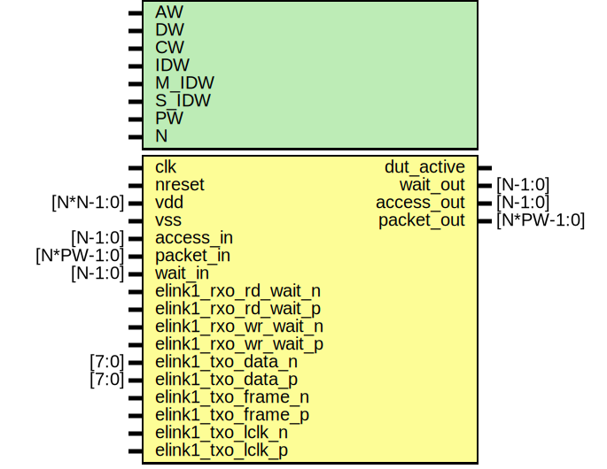

# Entity: dut

- **File**: dut_e16ref.v
## Diagram

## Generics

| Generic name | Type | Value | Description |
| ------------ | ---- | ----- | ----------- |
| AW           |      | 32    |             |
| DW           |      | 32    |             |
| CW           |      | 2     |             |
| IDW          |      | 12    |             |
| M_IDW        |      | 6     |             |
| S_IDW        |      | 12    |             |
| PW           |      | 104   |             |
| N            |      | 1     |             |
## Ports

| Port name            | Direction | Type       | Description                                                                                                                   |
| -------------------- | --------- | ---------- | ----------------------------------------------------------------------------------------------------------------------------- |
| clk                  | input     |            | ######################################## CLOCK AND RESET #######################################                              |
| nreset               | input     |            |                                                                                                                               |
| vdd                  | input     | [N*N-1:0]  |                                                                                                                               |
| vss                  | input     |            |                                                                                                                               |
| dut_active           | output    |            |                                                                                                                               |
| access_in            | input     | [N-1:0]    | ########################################EMESH INTERFACE  ####################################### Stimulus Driven Transaction  |
| packet_in            | input     | [N*PW-1:0] |                                                                                                                               |
| wait_out             | output    | [N-1:0]    |                                                                                                                               |
| access_out           | output    | [N-1:0]    | DUT driven transactoin                                                                                                        |
| packet_out           | output    | [N*PW-1:0] |                                                                                                                               |
| wait_in              | input     | [N-1:0]    |                                                                                                                               |
| elink1_rxo_rd_wait_n | input     |            | To elink0 of elink.v                                                                                                          |
| elink1_rxo_rd_wait_p | input     |            | To elink0 of elink.v                                                                                                          |
| elink1_rxo_wr_wait_n | input     |            | To elink0 of elink.v                                                                                                          |
| elink1_rxo_wr_wait_p | input     |            | To elink0 of elink.v                                                                                                          |
| elink1_txo_data_n    | input     | [7:0]      | To elink0 of elink.v                                                                                                          |
| elink1_txo_data_p    | input     | [7:0]      | To elink0 of elink.v                                                                                                          |
| elink1_txo_frame_n   | input     |            | To elink0 of elink.v                                                                                                          |
| elink1_txo_frame_p   | input     |            | To elink0 of elink.v                                                                                                          |
| elink1_txo_lclk_n    | input     |            | To elink0 of elink.v                                                                                                          |
| elink1_txo_lclk_p    | input     |            | To elink0 of elink.v                                                                                                          |
## Signals

| Name                     | Type          | Description                                                                                                                                                                               |
| ------------------------ | ------------- | ----------------------------------------------------------------------------------------------------------------------------------------------------------------------------------------- |
| elink0_cclk_n            | wire          | From elink0 of elink.v                                                                                                                                                                    |
| elink0_cclk_p            | wire          | From elink0 of elink.v                                                                                                                                                                    |
| elink0_chip_resetb       | wire          | From elink0 of elink.v                                                                                                                                                                    |
| elink0_chipid            | wire [11:0]   | From elink0 of elink.v                                                                                                                                                                    |
| elink0_mailbox_full      | wire          | From elink0 of elink.v                                                                                                                                                                    |
| elink0_mailbox_not_empty | wire          | From elink0 of elink.v                                                                                                                                                                    |
| elink0_timeout           | wire          | From elink0 of elink.v                                                                                                                                                                    |
| elink1_cclk_n            | wire          | From elink1 of elink.v                                                                                                                                                                    |
| elink1_cclk_p            | wire          | From elink1 of elink.v                                                                                                                                                                    |
| elink1_chip_resetb       | wire          | From elink1 of elink.v                                                                                                                                                                    |
| elink1_chipid            | wire [11:0]   | From elink1 of elink.v                                                                                                                                                                    |
| elink1_mailbox_full      | wire          | From elink1 of elink.v                                                                                                                                                                    |
| elink1_mailbox_not_empty | wire          | From elink1 of elink.v                                                                                                                                                                    |
| elink1_rxrd_access       | wire          | From elink1 of elink.v                                                                                                                                                                    |
| elink1_rxrd_packet       | wire [PW-1:0] | From elink1 of elink.v                                                                                                                                                                    |
| elink1_rxrr_access       | wire          | From elink1 of elink.v                                                                                                                                                                    |
| elink1_rxrr_packet       | wire [PW-1:0] | From elink1 of elink.v                                                                                                                                                                    |
| elink1_rxwr_access       | wire          | From elink1 of elink.v                                                                                                                                                                    |
| elink1_rxwr_packet       | wire [PW-1:0] | From elink1 of elink.v                                                                                                                                                                    |
| elink1_timeout           | wire          | From elink1 of elink.v                                                                                                                                                                    |
| elink1_txrd_wait         | wire          | From elink1 of elink.v                                                                                                                                                                    |
| elink1_txrr_access       | wire          | From emem of ememory.v                                                                                                                                                                    |
| elink1_txrr_packet       | wire [PW-1:0] | From emem of ememory.v                                                                                                                                                                    |
| elink1_txrr_wait         | wire          | From elink1 of elink.v                                                                                                                                                                    |
| elink1_txwr_wait         | wire          | From elink1 of elink.v                                                                                                                                                                    |
| emem_access              | wire          | memory wires                                                                                                                                                                              |
| emem_packet              | wire [PW-1:0] |                                                                                                                                                                                           |
| elink0_chip_nreset       | wire          | From elink0 of elink.v                                                                                                                                                                    |
| elink0_mailbox_irq       | wire          | From elink0 of elink.v                                                                                                                                                                    |
| elink0_rxo_rd_wait_n     | wire          | From elink0 of elink.v                                                                                                                                                                    |
| elink0_rxo_rd_wait_p     | wire          | From elink0 of elink.v                                                                                                                                                                    |
| elink0_rxo_wr_wait_n     | wire          | From elink0 of elink.v                                                                                                                                                                    |
| elink0_rxo_wr_wait_p     | wire          | From elink0 of elink.v                                                                                                                                                                    |
| elink0_rxrr_access       | wire          | From elink0 of elink.v                                                                                                                                                                    |
| elink0_rxrr_packet       | wire [PW-1:0] | From elink0 of elink.v                                                                                                                                                                    |
| elink0_txo_data_n        | wire [7:0]    | From elink0 of elink.v                                                                                                                                                                    |
| elink0_txo_data_p        | wire [7:0]    | From elink0 of elink.v                                                                                                                                                                    |
| elink0_txo_frame_n       | wire          | From elink0 of elink.v                                                                                                                                                                    |
| elink0_txo_frame_p       | wire          | From elink0 of elink.v                                                                                                                                                                    |
| elink0_txo_lclk_n        | wire          | From elink0 of elink.v                                                                                                                                                                    |
| elink0_txo_lclk_p        | wire          | From elink0 of elink.v                                                                                                                                                                    |
| elink0_txrd_access       | wire          | From emesh_if of emesh_if.v                                                                                                                                                               |
| elink0_txrd_packet       | wire [PW-1:0] | From emesh_if of emesh_if.v                                                                                                                                                               |
| elink0_txrd_wait         | wire          | From elink0 of elink.v                                                                                                                                                                    |
| elink0_txwr_access       | wire          | From emesh_if of emesh_if.v                                                                                                                                                               |
| elink0_txwr_packet       | wire [PW-1:0] | From emesh_if of emesh_if.v                                                                                                                                                               |
| elink0_txwr_wait         | wire          | From elink0 of elink.v                                                                                                                                                                    |
| emem_wait                | wire          |  Templated ###################################################################### 2ND ELINK (E16 REFERENCE MODEL) ######################################################################  |
| elink1_rcv_packet        | wire [103:0]  |                                                                                                                                                                                           |
| elink1_send_packet       | wire [103:0]  |                                                                                                                                                                                           |
## Instantiations

- elink_ref: elink_e16
