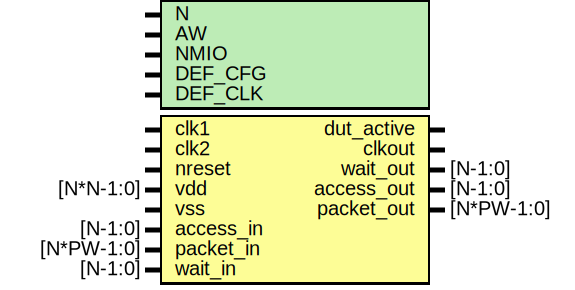

# Entity: dut

- **File**: dut_edma.v
## Diagram

## Generics

| Generic name | Type | Value    | Description                                                                                                                                                         |
| ------------ | ---- | -------- | ------------------------------------------------------------------------------------------------------------------------------------------------------------------- |
| N            |      | 1        | ##################################################################### # INTERFACE ##################################################################### parameters  |
| AW           |      | 32       |  address width                                                                                                                                                      |
| NMIO         |      | 8        |  IO data width                                                                                                                                                      |
| DEF_CFG      |      | 18'h1070 |  for 104 bits                                                                                                                                                       |
| DEF_CLK      |      | 7        |                                                                                                                                                                     |
## Ports

| Port name  | Direction | Type       | Description                 |
| ---------- | --------- | ---------- | --------------------------- |
| clk1       | input     |            | clock, reset                |
| clk2       | input     |            |                             |
| nreset     | input     |            |                             |
| vdd        | input     | [N*N-1:0]  |                             |
| vss        | input     |            |                             |
| dut_active | output    |            |                             |
| clkout     | output    |            |                             |
| access_in  | input     | [N-1:0]    | Stimulus Driven Transaction |
| packet_in  | input     | [N*PW-1:0] |                             |
| wait_out   | output    | [N-1:0]    |                             |
| access_out | output    | [N-1:0]    | DUT driven transactoin      |
| packet_out | output    | [N*PW-1:0] |                             |
| wait_in    | input     | [N-1:0]    |                             |
## Signals

| Name           | Type          | Description                                                                                     |
| -------------- | ------------- | ----------------------------------------------------------------------------------------------- |
| reg_access_in  | wire          | ######################################## # BODY ######################################## wires  |
| reg_packet_in  | wire [PW-1:0] |                                                                                                 |
| reg_wait_in    | wire          |                                                                                                 |
| edma_access_in | wire          |                                                                                                 |
| irq            | wire          | From edma of edma.v                                                                             |
| reg_access_out | wire          | From edma of edma.v                                                                             |
| reg_packet_out | wire [PW-1:0] | From edma of edma.v                                                                             |
| reg_wait_out   | wire          | From edma of edma.v                                                                             |
## Constants

| Name | Type | Value     | Description      |
| ---- | ---- | --------- | ---------------- |
| PW   |      | 2*AW + 40 | standard packet  |
