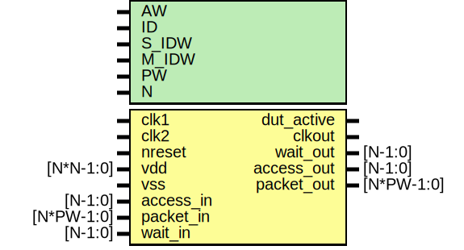

# Entity: dut

- **File**: dut_emmu.v
## Diagram

## Description

`include "elink_regmap.v"

## Generics

| Generic name | Type | Value     | Description                                                                                                                                                         |
| ------------ | ---- | --------- | ------------------------------------------------------------------------------------------------------------------------------------------------------------------- |
| AW           |      | 32        | ########################################################################## # INTERFACE  ##########################################################################  |
| ID           |      | 12'h810   |                                                                                                                                                                     |
| S_IDW        |      | 12        |                                                                                                                                                                     |
| M_IDW        |      | 6         |                                                                                                                                                                     |
| PW           |      | 2*AW + 40 |                                                                                                                                                                     |
| N            |      | 1         |                                                                                                                                                                     |
## Ports

| Port name  | Direction | Type       | Description                 |
| ---------- | --------- | ---------- | --------------------------- |
| clk1       | input     |            | clock,reset                 |
| clk2       | input     |            |                             |
| nreset     | input     |            |                             |
| vdd        | input     | [N*N-1:0]  |                             |
| vss        | input     |            |                             |
| dut_active | output    |            |                             |
| clkout     | output    |            |                             |
| access_in  | input     | [N-1:0]    | Stimulus Driven Transaction |
| packet_in  | input     | [N*PW-1:0] |                             |
| wait_out   | output    | [N-1:0]    |                             |
| access_out | output    | [N-1:0]    | DUT driven transaction      |
| packet_out | output    | [N*PW-1:0] |                             |
| wait_in    | input     | [N-1:0]    |                             |
## Signals

| Name        | Type          | Description                                                                                                                                                   |
| ----------- | ------------- | ------------------------------------------------------------------------------------------------------------------------------------------------------------- |
| mem_rd_wait | wire          | ########################################################################## #BODY  ##########################################################################  |
| mem_wr_wait | wire          |                                                                                                                                                               |
| mem_access  | wire          |                                                                                                                                                               |
| mem_packet  | wire [PW-1:0] |                                                                                                                                                               |
