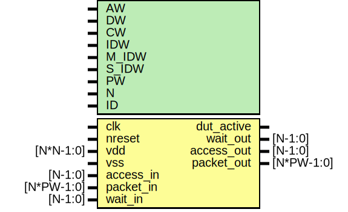

# Entity: dut

- **File**: dut_etrace.v
## Diagram

## Generics

| Generic name | Type | Value   | Description |
| ------------ | ---- | ------- | ----------- |
| AW           |      | 32      |             |
| DW           |      | 32      |             |
| CW           |      | 2       |             |
| IDW          |      | 12      |             |
| M_IDW        |      | 6       |             |
| S_IDW        |      | 12      |             |
| PW           |      | 104     |             |
| N            |      | 1       |             |
| ID           |      | 12'h810 |             |
## Ports

| Port name  | Direction | Type       | Description                                                                                                                   |
| ---------- | --------- | ---------- | ----------------------------------------------------------------------------------------------------------------------------- |
| clk        | input     |            | ######################################## CLOCK AND RESET #######################################                              |
| nreset     | input     |            |                                                                                                                               |
| vdd        | input     | [N*N-1:0]  |                                                                                                                               |
| vss        | input     |            |                                                                                                                               |
| dut_active | output    |            |                                                                                                                               |
| access_in  | input     | [N-1:0]    | ########################################EMESH INTERFACE  ####################################### Stimulus Driven Transaction  |
| packet_in  | input     | [N*PW-1:0] |                                                                                                                               |
| wait_out   | output    | [N-1:0]    |                                                                                                                               |
| access_out | output    | [N-1:0]    | DUT driven transactoin                                                                                                        |
| packet_out | output    | [N*PW-1:0] |                                                                                                                               |
| wait_in    | input     | [N-1:0]    |                                                                                                                               |
## Signals

| Name        | Type          | Description                 |
| ----------- | ------------- | --------------------------- |
| mi_dout     | wire [DW-1:0] | TODO: finish readback       |
| mi_ctrlmode | wire [3:0]    | From e2p of packet2emesh.v  |
| mi_data     | wire [DW-1:0] | From e2p of packet2emesh.v  |
| mi_datamode | wire [1:0]    | From e2p of packet2emesh.v  |
| mi_dstaddr  | wire [AW-1:0] | From e2p of packet2emesh.v  |
| mi_srcaddr  | wire [AW-1:0] | From e2p of packet2emesh.v  |
| mi_write    | wire          | From e2p of packet2emesh.v  |
