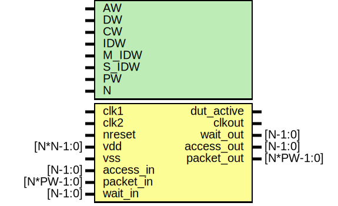

# Entity: dut

- **File**: dut_gpio.v
## Diagram

## Generics

| Generic name | Type | Value | Description |
| ------------ | ---- | ----- | ----------- |
| AW           |      | 32    |             |
| DW           |      | 32    |             |
| CW           |      | 2     |             |
| IDW          |      | 12    |             |
| M_IDW        |      | 6     |             |
| S_IDW        |      | 12    |             |
| PW           |      | 104   |             |
| N            |      | 32    |             |
## Ports

| Port name  | Direction | Type       | Description                                                                                                                   |
| ---------- | --------- | ---------- | ----------------------------------------------------------------------------------------------------------------------------- |
| clk1       | input     |            | ######################################## CLOCK AND RESET #######################################                              |
| clk2       | input     |            |                                                                                                                               |
| nreset     | input     |            |                                                                                                                               |
| vdd        | input     | [N*N-1:0]  |                                                                                                                               |
| vss        | input     |            |                                                                                                                               |
| dut_active | output    |            |                                                                                                                               |
| clkout     | output    |            |                                                                                                                               |
| access_in  | input     | [N-1:0]    | ########################################EMESH INTERFACE  ####################################### Stimulus Driven Transaction  |
| packet_in  | input     | [N*PW-1:0] |                                                                                                                               |
| wait_out   | output    | [N-1:0]    |                                                                                                                               |
| access_out | output    | [N-1:0]    | DUT driven transactoin                                                                                                        |
| packet_out | output    | [N*PW-1:0] |                                                                                                                               |
| wait_in    | input     | [N-1:0]    |                                                                                                                               |
## Signals

| Name     | Type          | Description          |
| -------- | ------------- | -------------------- |
| gpio_dir | wire [AW-1:0] | From gpio of gpio.v  |
| gpio_irq | wire          | From gpio of gpio.v  |
| gpio_out | wire [AW-1:0] | From gpio of gpio.v  |
| clk      | wire          |  End of automatics   |
| gpio_in  | wire [AW-1:0] | To gpio of gpio.v    |
