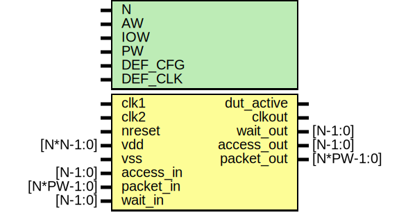

# Entity: dut

- **File**: dut_mio.v
## Diagram

## Generics

| Generic name | Type | Value    | Description                     |
| ------------ | ---- | -------- | ------------------------------- |
| N            |      | 1        |  number of slices               |
| AW           |      | 32       |  address width                  |
| IOW          |      | 64       |  IO data width                  |
| PW           |      | 104      |  standard packet                |
| DEF_CFG      |      | 18'h0010 |  16 bit interface, sdr mode     |
| DEF_CLK      |      | 7        |                                 |
## Ports

| Port name  | Direction | Type       | Description                 |
| ---------- | --------- | ---------- | --------------------------- |
| clk1       | input     |            | clock, reset                |
| clk2       | input     |            |                             |
| nreset     | input     |            |                             |
| vdd        | input     | [N*N-1:0]  |                             |
| vss        | input     |            |                             |
| dut_active | output    |            |                             |
| clkout     | output    |            |                             |
| access_in  | input     | [N-1:0]    | Stimulus Driven Transaction |
| packet_in  | input     | [N*PW-1:0] |                             |
| wait_out   | output    | [N-1:0]    |                             |
| access_out | output    | [N-1:0]    | DUT driven transactoin      |
| packet_out | output    | [N*PW-1:0] |                             |
| wait_in    | input     | [N-1:0]    |                             |
## Signals

| Name           | Type           | Description                                                                                     |
| -------------- | -------------- | ----------------------------------------------------------------------------------------------- |
| reg_access_in  | wire           | ######################################## # BODY ######################################## wires  |
| reg_packet_in  | wire [PW-1:0]  |                                                                                                 |
| reg_wait_in    | wire           |                                                                                                 |
| mio_access_in  | wire           |                                                                                                 |
| reg_access_out | wire           | From mio of mio.v                                                                               |
| reg_packet_out | wire [PW-1:0]  | From mio of mio.v                                                                               |
| reg_wait_out   | wire           | From mio of mio.v                                                                               |
| rx_wait        | wire           | From mio of mio.v                                                                               |
| tx_access      | wire           | From mio of mio.v                                                                               |
| tx_clk         | wire           | From mio of mio.v                                                                               |
| tx_packet      | wire [IOW-1:0] | From mio of mio.v                                                                               |
