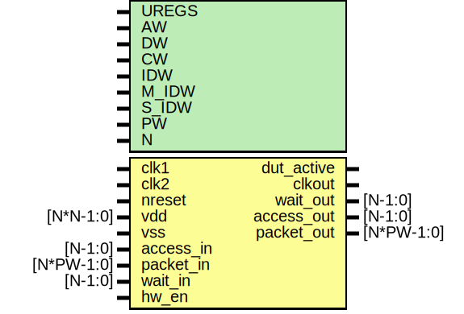

# Entity: dut

- **File**: dut_spi.v
## Diagram

## Generics

| Generic name | Type | Value | Description |
| ------------ | ---- | ----- | ----------- |
| UREGS        |      | 13    |             |
| AW           |      | 32    |             |
| DW           |      | 32    |             |
| CW           |      | 2     |             |
| IDW          |      | 12    |             |
| M_IDW        |      | 6     |             |
| S_IDW        |      | 12    |             |
| PW           |      | 104   |             |
| N            |      | 1     |             |
## Ports

| Port name  | Direction | Type       | Description                                                                                                                   |
| ---------- | --------- | ---------- | ----------------------------------------------------------------------------------------------------------------------------- |
| clk1       | input     |            | ######################################## CLOCK AND RESET #######################################                              |
| clk2       | input     |            |                                                                                                                               |
| nreset     | input     |            |                                                                                                                               |
| vdd        | input     | [N*N-1:0]  |                                                                                                                               |
| vss        | input     |            |                                                                                                                               |
| dut_active | output    |            |                                                                                                                               |
| clkout     | output    |            |                                                                                                                               |
| access_in  | input     | [N-1:0]    | ########################################EMESH INTERFACE  ####################################### Stimulus Driven Transaction  |
| packet_in  | input     | [N*PW-1:0] |                                                                                                                               |
| wait_out   | output    | [N-1:0]    |                                                                                                                               |
| access_out | output    | [N-1:0]    | DUT driven transaction                                                                                                        |
| packet_out | output    | [N*PW-1:0] |                                                                                                                               |
| wait_in    | input     | [N-1:0]    |                                                                                                                               |
| hw_en      | input     |            | To master of spi.v, ...                                                                                                       |
## Signals

| Name           | Type          | Description                |
| -------------- | ------------- | -------------------------- |
| clk            | wire          |                            |
| mem_packet_out | wire [PW-1:0] |                            |
| mem_packet_in  | wire [PW-1:0] |                            |
| m_mosi         | wire          | From master of spi.v       |
| m_sclk         | wire          | From master of spi.v       |
| m_ss           | wire          | From master of spi.v       |
| s_miso         | wire          | From slave of spi.v        |
| spi_irq        | wire          | From master of spi.v, ...  |
