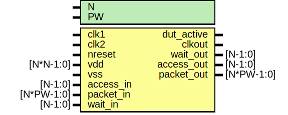

# Entity: dut

- **File**: dut_template.v
## Diagram

## Generics

| Generic name | Type | Value | Description |
| ------------ | ---- | ----- | ----------- |
| N            |      | 1     | parameters  |
| PW           |      | 104   |             |
## Ports

| Port name  | Direction | Type       | Description                 |
| ---------- | --------- | ---------- | --------------------------- |
| clk1       | input     |            | clock, reset                |
| clk2       | input     |            |                             |
| nreset     | input     |            |                             |
| vdd        | input     | [N*N-1:0]  |                             |
| vss        | input     |            |                             |
| dut_active | output    |            |                             |
| clkout     | output    |            |                             |
| access_in  | input     | [N-1:0]    | Stimulus Driven Transaction |
| packet_in  | input     | [N*PW-1:0] |                             |
| wait_out   | output    | [N-1:0]    |                             |
| access_out | output    | [N-1:0]    | DUT driven transactoin      |
| packet_out | output    | [N*PW-1:0] |                             |
| wait_in    | input     | [N-1:0]    |                             |
