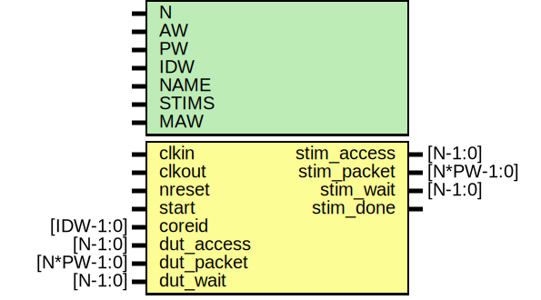

# Entity: dv_driver

- **File**: dv_driver.v
## Diagram

## Description

 verilator lint_off STMTDLY */

## Generics

| Generic name | Type | Value  | Description                 |
| ------------ | ---- | ------ | --------------------------- |
| N            |      | 1      |  "N" packets wide           |
| AW           |      | 32     |  address width              |
| PW           |      | 104    |  packet width (derived)     |
| IDW          |      | 12     |  id width                   |
| NAME         |      | "none" |  north, south etc           |
| STIMS        |      | 1      |  number of stimulus         |
| MAW          |      | 16     |  64KB memory address width  |
## Ports

| Port name   | Direction | Type       | Description              |
| ----------- | --------- | ---------- | ------------------------ |
| clkin       | input     |            | control signals          |
| clkout      | input     |            |                          |
| nreset      | input     |            |                          |
| start       | input     |            | starts test              |
| coreid      | input     | [IDW-1:0]  | everything has a coreid! |
| dut_access  | input     | [N-1:0]    | inputs for monitoring    |
| dut_packet  | input     | [N*PW-1:0] |                          |
| dut_wait    | input     | [N-1:0]    |                          |
| stim_access | output    | [N-1:0]    | stimulus to drive        |
| stim_packet | output    | [N*PW-1:0] |                          |
| stim_wait   | output    | [N-1:0]    |                          |
| stim_done   | output    |            |                          |
## Signals

| Name           | Type             | Description                              |
| -------------- | ---------------- | ---------------------------------------- |
| offset         | reg [IDW-1:0]    | ############# LOCAL WIRES #############  |
| stim_count     | wire [N*32-1:0]  |                                          |
| stim_vec_done  | wire [N-1:0]     |                                          |
| coreid_array   | wire [N*IDW-1:0] |                                          |
| mem_packet_out | wire [N*PW-1:0]  |                                          |
| mem_access_out | wire [N-1:0]     |                                          |
| mem_wait_out   | wire [N-1:0]     |                                          |
| end            | end              |                                          |
| initial        | endgenerate      |                                          |
| offset         | else             |                                          |
| genvar         | end              |                                          |
