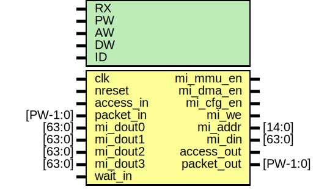

# Entity: ecfg_if

- **File**: ecfg_if.v
## Diagram

## Generics

| Generic name | Type | Value   | Description |
| ------------ | ---- | ------- | ----------- |
| RX           |      | 0       | 0,1         |
| PW           |      | 104     |             |
| AW           |      | 32      |             |
| DW           |      | 32      |             |
| ID           |      | 12'h999 |             |
## Ports

| Port name  | Direction | Type     | Description                                                                                        |
| ---------- | --------- | -------- | -------------------------------------------------------------------------------------------------- |
| clk        | input     |          | *******************************/Clocks/reset                  */ *******************************/  |
| nreset     | input     |          |                                                                                                    |
| access_in  | input     |          | *******************************/Incoming Packet               */ *******************************/  |
| packet_in  | input     | [PW-1:0] |                                                                                                    |
| mi_mmu_en  | output    |          | *******************************/ Register Interface           */ *******************************/  |
| mi_dma_en  | output    |          |                                                                                                    |
| mi_cfg_en  | output    |          |                                                                                                    |
| mi_we      | output    |          |                                                                                                    |
| mi_addr    | output    | [14:0]   |                                                                                                    |
| mi_din     | output    | [63:0]   |                                                                                                    |
| mi_dout0   | input     | [63:0]   |                                                                                                    |
| mi_dout1   | input     | [63:0]   |                                                                                                    |
| mi_dout2   | input     | [63:0]   |                                                                                                    |
| mi_dout3   | input     | [63:0]   |                                                                                                    |
| access_out | output    |          | *******************************/ Outgoing Packet              */ *******************************/  |
| packet_out | output    | [PW-1:0] |                                                                                                    |
| wait_in    | input     |          | incoming wait                                                                                      |
## Signals

| Name           | Type        | Description |
| -------------- | ----------- | ----------- |
| dstaddr        | wire [31:0] | wires       |
| data           | wire [31:0] |             |
| srcaddr        | wire [31:0] |             |
| datamode       | wire [1:0]  |             |
| ctrlmode       | wire [4:0]  |             |
| mi_dout_mux    | wire [63:0] |             |
| mi_rd          | wire        |             |
| access_forward | wire        |             |
| rxsel          | wire        |             |
| mi_en          | wire        |             |
| access_out     | reg         | regs;       |
| dstaddr_reg    | reg [31:0]  |             |
| srcaddr_reg    | reg [31:0]  |             |
| datamode_reg   | reg [1:0]   |             |
| ctrlmode_reg   | reg [3:0]   |             |
| write_reg      | reg         |             |
| readback_reg   | reg         |             |
| data_reg       | reg [31:0]  |             |
| data_out       | wire [31:0] |             |
| write          | wire        |             |
| mi_match       | wire        |             |
| mi_rx_sel      | wire        |             |
| myid           | wire [11:0] |             |
## Processes
- unnamed: ( @ (posedge clk or negedge nreset) )
  - **Type:** always
- unnamed: ( @ (posedge clk) )
  - **Type:** always
