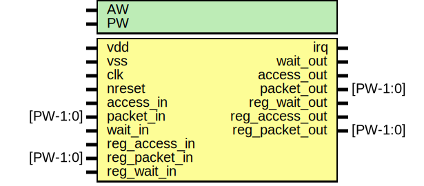

# Entity: edma

- **File**: edma.v
## Diagram

## Description

#############################################################################
# Purpose: A DMA ENGINE                                                     #
#############################################################################
# Author:   Andreas Olofsson                                                #
# License:  MIT (see below)                                                 # 
#############################################################################

## Generics

| Generic name | Type | Value | Description     |
| ------------ | ---- | ----- | --------------- |
| AW           |      | 32    |  address width  |
| PW           |      | 104   |  packet width   |
## Ports

| Port name      | Direction | Type     | Description                  |
| -------------- | --------- | -------- | ---------------------------- |
| vdd            | input     |          | supply                       |
| vss            | input     |          | common ground                |
| clk            | input     |          | main core clock              |
| nreset         | input     |          | async active low reset       |
| irq            | output    |          | interrupt output             |
| access_in      | input     |          | streaming input access       |
| packet_in      | input     | [PW-1:0] | streaming input data         |
| wait_out       | output    |          | pushback                     |
| access_out     | output    |          | output access (master/slave) |
| packet_out     | output    | [PW-1:0] | output packet (with address) |
| wait_in        | input     |          | pushback                     |
| reg_access_in  | input     |          | config register access       |
| reg_packet_in  | input     | [PW-1:0] | config register packet       |
| reg_wait_out   | output    |          | pushback by register read    |
| reg_access_out | output    |          | config readback              |
| reg_packet_out | output    | [PW-1:0] | config reacback packet       |
| reg_wait_in    | input     |          | pushback for readback        |
## Signals

| Name          | Type          | Description                    |
| ------------- | ------------- | ------------------------------ |
| chainmode     | wire          | From edma_regs of edma_regs.v  |
| count         | wire [31:0]   | From edma_dp of edma_dp.v      |
| count_reg     | wire [31:0]   | From edma_regs of edma_regs.v  |
| ctrlmode      | wire [4:0]    | From edma_regs of edma_regs.v  |
| curr_descr    | wire [15:0]   | From edma_regs of edma_regs.v  |
| datamode      | wire [1:0]    | From edma_regs of edma_regs.v  |
| dma_en        | wire          | From edma_regs of edma_regs.v  |
| dma_state     | wire [3:0]    | From edma_ctrl of edma_ctrl.v  |
| dstaddr       | wire [AW-1:0] | From edma_dp of edma_dp.v      |
| dstaddr_reg   | wire [63:0]   | From edma_regs of edma_regs.v  |
| fetch_access  | wire          | From edma_ctrl of edma_ctrl.v  |
| fetch_packet  | wire [PW-1:0] | From edma_ctrl of edma_ctrl.v  |
| manualmode    | wire          | From edma_regs of edma_regs.v  |
| master_active | wire          | From edma_ctrl of edma_ctrl.v  |
| mastermode    | wire          | From edma_regs of edma_regs.v  |
| next_descr    | wire [15:0]   | From edma_regs of edma_regs.v  |
| srcaddr       | wire [AW-1:0] | From edma_dp of edma_dp.v      |
| srcaddr_reg   | wire [63:0]   | From edma_regs of edma_regs.v  |
| stride_reg    | wire [31:0]   | From edma_regs of edma_regs.v  |
| update        | wire          | From edma_ctrl of edma_ctrl.v  |
| update2d      | wire          | From edma_ctrl of edma_ctrl.v  |
