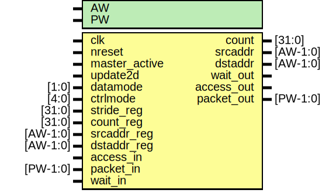

# Entity: edma_dp

- **File**: edma_dp.v
## Diagram

## Description

#############################################################################
# Purpose: DMA datapath                                                     #
#############################################################################
# Author:   Andreas Olofsson                                                #
# License:  MIT (see below)                                                 # 
#############################################################################

## Generics

| Generic name | Type | Value   | Description             |
| ------------ | ---- | ------- | ----------------------- |
| AW           |      | 8       |  divider counter width  |
| PW           |      | 2*AW+40 |  emesh packet width     |
## Ports

| Port name     | Direction | Type     | Description                  |
| ------------- | --------- | -------- | ---------------------------- |
| clk           | input     |          | main clock                   |
| nreset        | input     |          | async active low reset       |
| master_active | input     |          | master mode active           |
| update2d      | input     |          | outer loop transfer          |
| datamode      | input     | [1:0]    | datamode for master mode     |
| ctrlmode      | input     | [4:0]    | ctrlmode for master mode     |
| stride_reg    | input     | [31:0]   | transfer stride              |
| count_reg     | input     | [31:0]   | starting count               |
| srcaddr_reg   | input     | [AW-1:0] | starting source address      |
| dstaddr_reg   | input     | [AW-1:0] | starting destination address |
| count         | output    | [31:0]   | current count                |
| srcaddr       | output    | [AW-1:0] | current source address       |
| dstaddr       | output    | [AW-1:0] | current source address       |
| access_in     | input     |          |  datapath interface          |
| packet_in     | input     | [PW-1:0] | streaming input data         |
| wait_out      | output    |          |                              |
| access_out    | output    |          |                              |
| packet_out    | output    | [PW-1:0] | output packet (with address) |
| wait_in       | input     |          | pushback                     |
## Signals

| Name         | Type          | Description                                                                                                                                                 |
| ------------ | ------------- | ----------------------------------------------------------------------------------------------------------------------------------------------------------- |
| packet_out   | reg [PW-1:0]  | ###################################################################### # BODY ######################################################################  regs  |
| access_out   | reg           |                                                                                                                                                             |
| ctrlmode_out | wire [4:0]    |  wires                                                                                                                                                      |
| data_out     | wire [AW-1:0] |                                                                                                                                                             |
| datamode_out | wire [1:0]    |                                                                                                                                                             |
| dstaddr_out  | wire [AW-1:0] |                                                                                                                                                             |
| srcaddr_out  | wire [AW-1:0] |                                                                                                                                                             |
| write_out    | wire          |                                                                                                                                                             |
| packet       | wire [PW-1:0] |                                                                                                                                                             |
| ctrlmode_in  | wire [4:0]    | From p2e of packet2emesh.v                                                                                                                                  |
| data_in      | wire [AW-1:0] | From p2e of packet2emesh.v                                                                                                                                  |
| datamode_in  | wire [1:0]    | From p2e of packet2emesh.v                                                                                                                                  |
| dstaddr_in   | wire [AW-1:0] | From p2e of packet2emesh.v                                                                                                                                  |
| srcaddr_in   | wire [AW-1:0] | From p2e of packet2emesh.v                                                                                                                                  |
| write_in     | wire          | From p2e of packet2emesh.v                                                                                                                                  |
## Processes
- unnamed: ( @ (posedge clk) )
  - **Type:** always
 **Description**
################################ # REGISTER (FOR TIMING PURPOSES) ################################  pipelining the packet 
- unnamed: ( @ (posedge clk) )
  - **Type:** always
 **Description**
 access signal 
