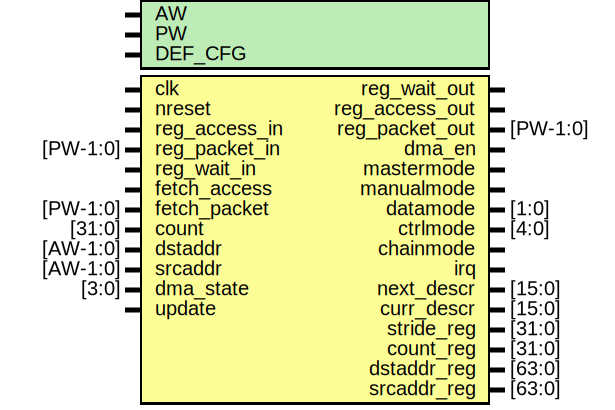

# Entity: edma_regs

- **File**: edma_regs.v
## Diagram

## Description

#############################################################################
# Purpose: DMA registers                                                    #
#############################################################################
# Author:   Andreas Olofsson                                                #
# License:  MIT (see below)                                                 # 
#############################################################################

## Generics

| Generic name | Type | Value   | Description                     |
| ------------ | ---- | ------- | ------------------------------- |
| AW           |      | 8       |  address width                  |
| PW           |      | 2*AW+40 |  emesh packet width             |
| DEF_CFG      |      | 0       |  default config after reset     |
## Ports

| Port name      | Direction | Type     | Description                               |
| -------------- | --------- | -------- | ----------------------------------------- |
| clk            | input     |          | main clock                                |
| nreset         | input     |          | async active low reset                    |
| reg_access_in  | input     |          | config register access                    |
| reg_packet_in  | input     | [PW-1:0] | config register packet                    |
| reg_wait_out   | output    |          | pushback by register read                 |
| reg_access_out | output    |          | config readback                           |
| reg_packet_out | output    | [PW-1:0] | config reacback packet                    |
| reg_wait_in    | input     |          | pushback for readback                     |
| fetch_access   | input     |          | fetch descriptor                          |
| fetch_packet   | input     | [PW-1:0] | fetch packet (mux with readback)          |
| dma_en         | output    |          | enable dma                                |
| mastermode     | output    |          | dma in master mode                        |
| manualmode     | output    |          | 0=fetch descriptor, 1=assume config ready |
| datamode       | output    | [1:0]    | transfer size (8,16,32,64 bits)           |
| ctrlmode       | output    | [4:0]    | ctrlmode                                  |
| chainmode      | output    |          | auto wrap around                          |
| irq            | output    |          | interrupt output                          |
| next_descr     | output    | [15:0]   | pointer to next descriptor                |
| curr_descr     | output    | [15:0]   | pointer to current descriptor             |
| stride_reg     | output    | [31:0]   | stride                                    |
| count_reg      | output    | [31:0]   | register transfer count                   |
| dstaddr_reg    | output    | [63:0]   | register destination address              |
| srcaddr_reg    | output    | [63:0]   | register source address                   |
| count          | input     | [31:0]   | current count                             |
| dstaddr        | input     | [AW-1:0] | current destination address               |
| srcaddr        | input     | [AW-1:0] | current source address                    |
| dma_state      | input     | [3:0]    | dma sequencer state                       |
| update         | input     |          | update registers                          |
## Signals

| Name           | Type          | Description                                                                                                                                                 |
| -------------- | ------------- | ----------------------------------------------------------------------------------------------------------------------------------------------------------- |
| config_reg     | reg [31:0]    | ###################################################################### # BODY ######################################################################  regs  |
| count_reg      | reg [31:0]    |                                                                                                                                                             |
| stride_reg     | reg [31:0]    |                                                                                                                                                             |
| dstaddr_reg    | reg [63:0]    |                                                                                                                                                             |
| srcaddr_reg    | reg [63:0]    |                                                                                                                                                             |
| status_reg     | reg [31:0]    |                                                                                                                                                             |
| reg_write      | wire          |  wires                                                                                                                                                      |
| config_write   | wire          |                                                                                                                                                             |
| stride_write   | wire          |                                                                                                                                                             |
| count_write    | wire          |                                                                                                                                                             |
| srcaddr0_write | wire          |                                                                                                                                                             |
| srcaddr1_write | wire          |                                                                                                                                                             |
| dstaddr0_write | wire          |                                                                                                                                                             |
| dstaddr1_write | wire          |                                                                                                                                                             |
| status_write   | wire          |                                                                                                                                                             |
| irqmode        | wire          |                                                                                                                                                             |
| ctrlmode_in    | wire [4:0]    | From p2e of packet2emesh.v                                                                                                                                  |
| data_in        | wire [AW-1:0] | From p2e of packet2emesh.v                                                                                                                                  |
| datamode_in    | wire [1:0]    | From p2e of packet2emesh.v                                                                                                                                  |
| dstaddr_in     | wire [AW-1:0] | From p2e of packet2emesh.v                                                                                                                                  |
| srcaddr_in     | wire [AW-1:0] | From p2e of packet2emesh.v                                                                                                                                  |
| write_in       | wire          | From p2e of packet2emesh.v                                                                                                                                  |
## Processes
- unnamed: ( @ (posedge clk or negedge nreset) )
  - **Type:** always
 **Description**
################################ # CONFIG ################################  
- unnamed: ( @ (posedge clk) )
  - **Type:** always
 **Description**
 pointer to fetch descriptor ################################ # STRIDE ################################  
- unnamed: ( @ (posedge clk) )
  - **Type:** always
 **Description**
################################ # COUNT ################################  
- unnamed: ( @ (posedge clk) )
  - **Type:** always
 **Description**
################################ # SRCADDR ################################  
- unnamed: ( @ (posedge clk) )
  - **Type:** always
 **Description**
################################ # DSTADDR ################################  
- unnamed: ( @ (posedge clk) )
  - **Type:** always
 **Description**
################################ # STATUS ################################  
