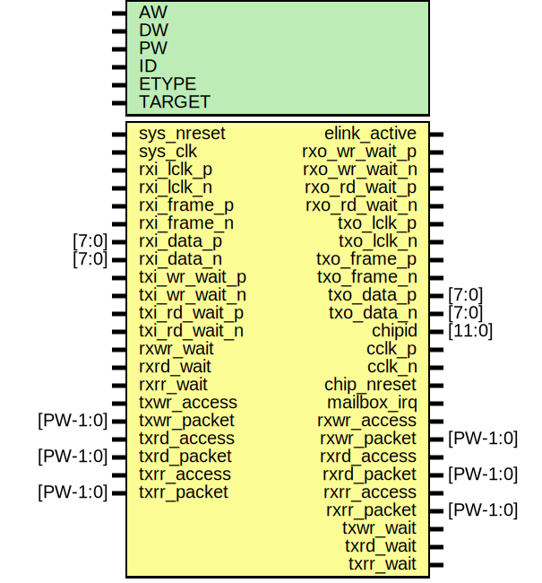

# Entity: elink

- **File**: elink.v
## Diagram

## Generics

| Generic name | Type | Value    | Description                             |
| ------------ | ---- | -------- | --------------------------------------- |
| AW           |      | 32       | native address width                    |
| DW           |      | 32       | native data width                       |
| PW           |      | 104      | packet width                            |
| ID           |      | 12'h810  | epiphany ID for elink (ie addr[31:20])  |
| ETYPE        |      | 1        |                                         |
| TARGET       |      | "XILINX" |                                         |
## Ports

| Port name     | Direction | Type     | Description                                                                                                      |
| ------------- | --------- | -------- | ---------------------------------------------------------------------------------------------------------------- |
| sys_nreset    | input     |          | reset for axi facing logic (active low)                                                                          |
| sys_clk       | input     |          | single system clock for master/slave FIFOs                                                                       |
| elink_active  | output    |          | rx and tx are both active                                                                                        |
| rxi_lclk_p    | input     |          | rx clock input                                                                                                   |
|    rxi_lclk_n | input     |          | rx clock input                                                                                                   |
| rxi_frame_p   | input     |          | rx frame signal                                                                                                  |
|   rxi_frame_n | input     |          | rx frame signal                                                                                                  |
| rxi_data_p    | input     | [7:0]    | rx data                                                                                                          |
|    rxi_data_n | input     | [7:0]    | rx data                                                                                                          |
| rxo_wr_wait_p | output    |          | rx write pushback output                                                                                         |
| rxo_wr_wait_n | output    |          | rx write pushback output                                                                                         |
| rxo_rd_wait_p | output    |          | rx read pushback output                                                                                          |
| rxo_rd_wait_n | output    |          | rx read pushback output                                                                                          |
| txo_lclk_p    | output    |          | tx clock output                                                                                                  |
| txo_lclk_n    | output    |          | tx clock output                                                                                                  |
| txo_frame_p   | output    |          | tx frame signal                                                                                                  |
| txo_frame_n   | output    |          | tx frame signal                                                                                                  |
| txo_data_p    | output    | [7:0]    | tx data                                                                                                          |
|    txo_data_n | output    | [7:0]    | tx data                                                                                                          |
| txi_wr_wait_p | input     |          | tx write pushback input                                                                                          |
| txi_wr_wait_n | input     |          | tx write pushback input                                                                                          |
| txi_rd_wait_p | input     |          | tx read pushback input                                                                                           |
| txi_rd_wait_n | input     |          | tx read pushback input                                                                                           |
| chipid        | output    | [11:0]   | chip id strap pins for epiphany                                                                                  |
| cclk_p        | output    |          | chip clock                                                                                                       |
| cclk_n        | output    |          | chip clock                                                                                                       |
| chip_nreset   | output    |          | From etx of etx.v                                                                                                |
| mailbox_irq   | output    |          | ****************************/MAILBOX INTERRUPTS         */ ****************************/                         |
| rxwr_access   | output    |          | ****************************/SYSTEM SIDE INTERFACE      */ ****************************/ Master Write (from RX)  |
| rxwr_packet   | output    | [PW-1:0] |                                                                                                                  |
| rxwr_wait     | input     |          |                                                                                                                  |
| rxrd_access   | output    |          | Master Read Request (from RX)                                                                                    |
| rxrd_packet   | output    | [PW-1:0] |                                                                                                                  |
| rxrd_wait     | input     |          |                                                                                                                  |
| rxrr_access   | output    |          | Slave Read Response (from RX)                                                                                    |
| rxrr_packet   | output    | [PW-1:0] |                                                                                                                  |
| rxrr_wait     | input     |          |                                                                                                                  |
| txwr_access   | input     |          | Slave Write (to TX)                                                                                              |
| txwr_packet   | input     | [PW-1:0] |                                                                                                                  |
| txwr_wait     | output    |          |                                                                                                                  |
| txrd_access   | input     |          | Slave Read Request (to TX)                                                                                       |
| txrd_packet   | input     | [PW-1:0] |                                                                                                                  |
| txrd_wait     | output    |          |                                                                                                                  |
| txrr_access   | input     |          | Master Read Response (to TX)                                                                                     |
| txrr_packet   | input     | [PW-1:0] |                                                                                                                  |
| txrr_wait     | output    |          |                                                                                                                  |
## Signals

| Name              | Type          | Description                    |
| ----------------- | ------------- | ------------------------------ |
| erx_cfg_access    | wire          | To erx of erx.v                |
| erx_cfg_packet    | wire [PW-1:0] | To erx of erx.v                |
| etx_cfg_wait      | wire          | To etx of etx.v                |
| mi_rd_data        | wire [31:0]   |                                |
| mi_dout_ecfg      | wire [31:0]   |                                |
| mi_dout_embox     | wire [31:0]   |                                |
| erx_cfg_wait      | wire          | From erx of erx.v              |
| erx_nreset        | wire          | From erx of erx.v              |
| erx_soft_reset    | wire          | From elink_cfg of elink_cfg.v  |
| etx_cfg_access    | wire          | From etx of etx.v              |
| etx_cfg_packet    | wire [PW-1:0] | From etx of etx.v              |
| etx_nreset        | wire          | From etx of etx.v              |
| etx_soft_reset    | wire          | From elink_cfg of elink_cfg.v  |
| rx_lclk_div4      | wire          | From erx of erx.v              |
| tx_active         | wire          | From etx of etx.v              |
| tx_lclk_div4      | wire          | From etx of etx.v              |
| txwr_gated_access | wire          | From elink_cfg of elink_cfg.v  |
