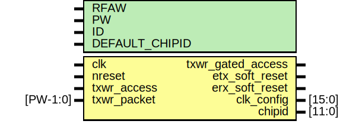

# Entity: elink_cfg

- **File**: elink_cfg.v
## Diagram

## Generics

| Generic name   | Type | Value   | Description            |
| -------------- | ---- | ------- | ---------------------- |
| RFAW           |      | 6       |  32 registers for now  |
| PW             |      | 104     |  32 registers for now  |
| ID             |      | 12'h000 |                        |
| DEFAULT_CHIPID |      | 12'h808 |                        |
## Ports

| Port name         | Direction | Type     | Description                                                                                  |
| ----------------- | --------- | -------- | -------------------------------------------------------------------------------------------- |
| clk               | input     |          | *****************************/Clock/reset                 */ *****************************/  |
| nreset            | input     |          | POR "hard reset"                                                                             |
| txwr_access       | input     |          | *****************************/REGISTER ACCESS             */ *****************************/  |
| txwr_packet       | input     | [PW-1:0] |                                                                                              |
| txwr_gated_access | output    |          | *****************************/FILTERED WRITE FOR TX FIFO  */ *****************************/  |
| etx_soft_reset    | output    |          | tx soft reset (level)                                                                        |
| erx_soft_reset    | output    |          | rx soft reset (level)                                                                        |
| clk_config        | output    | [15:0]   | clock settings (for pll)                                                                     |
| chipid            | output    | [11:0]   | chip-id for Epiphany                                                                         |
## Signals

| Name              | Type        | Description                                                                           |
| ----------------- | ----------- | ------------------------------------------------------------------------------------- |
| ecfg_reset_reg    | reg [1:0]   | ------------------------CODE BODY---------------------------------------*/ registers  |
| ecfg_clk_reg      | reg [15:0]  |                                                                                       |
| ecfg_chipid       | reg [11:0]  |                                                                                       |
| mi_dout           | reg [31:0]  |                                                                                       |
| ecfg_read         | wire        | wires                                                                                 |
| ecfg_write        | wire        |                                                                                       |
| ecfg_clk_write    | wire        |                                                                                       |
| ecfg_chipid_write | wire        |                                                                                       |
| ecfg_reset_write  | wire        |                                                                                       |
| mi_en             | wire        |                                                                                       |
| mi_addr           | wire [31:0] |                                                                                       |
| mi_din            | wire [31:0] |                                                                                       |
| mi_we             | wire        |                                                                                       |
## Processes
- unnamed: ( @ (posedge clk or negedge nreset) )
  - **Type:** always
 **Description**
########################### # RESET REG (ASYNC) ########################### 
- unnamed: ( @ (posedge clk or negedge nreset) )
  - **Type:** always
 **Description**
########################### # CCLK/LCLK (PLL) ########################### TODO: implement! 
- unnamed: ( @ (posedge clk or negedge nreset) )
  - **Type:** always
 **Description**
########################### # CHIPID ########################### 
