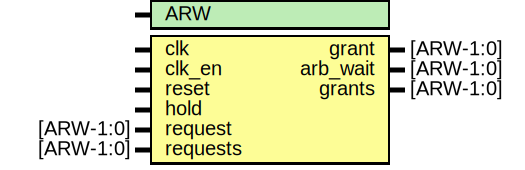

# Entity: e16_arbiter_priority

- **File**: elink_e16_model.v
## Diagram

## Generics

| Generic name | Type | Value | Description |
| ------------ | ---- | ----- | ----------- |
| ARW          |      | 99    |             |
## Ports

| Port name | Direction | Type      | Description                                                                                                  |
| --------- | --------- | --------- | ------------------------------------------------------------------------------------------------------------ |
| clk       | input     |           |                                                                                                              |
| clk_en    | input     |           |                                                                                                              |
| reset     | input     |           |                                                                                                              |
| hold      | input     |           |                                                                                                              |
| request   | input     | [ARW-1:0] |                                                                                                              |
| grant     | output    | [ARW-1:0] |                                                                                                              |
| arb_wait  | output    | [ARW-1:0] |                                                                                                              |
| requests  | input     | [ARW-1:0] | enable mask rotation, makes arbiter more flexiblein mesh there should be a way to control freq of rotation   |
| grants    | output    | [ARW-1:0] |                                                                                                              |
## Signals

| Name                   | Type             | Description    |
| ---------------------- | ---------------- | -------------- |
| grant_mask             | wire [ARW-1:0]   | wires          |
| request_mask           | wire [ARW-1:0]   |                |
| grant_hold             | reg [ARW-1:0]    | regs           |
| m                      | integer          | loop variable  |
| request_mask           | reg  [ARW-1:0]   | rotating mask  |
| grants_rotate_buffer   | reg [2*ARW-1:0]  | Wires          |
| grants                 | reg [ARW-1:0]    | output grants  |
| shifted_requests       | wire [ARW-1:0]   |                |
| shifted_grants         | wire [ARW-1:0]   |                |
| requests_rotate_buffer | wire [2*ARW-1:0] |                |
## Processes
- unnamed: ( @ (posedge clk or posedge reset) )
  - **Type:** always
 **Description**
hold circuit 
- unnamed: ( @ ( posedge clk or posedge reset) )
  - **Type:** always
 **Description**
*******************************************************************/ Rotating Mask Pointer On Every Clock Cycle                        */ *******************************************************************/ request vector[7:0]-->regular hold vector[7:0]   -->sets the priority to the request when it wins                       there can be multiple bits set                       the only one active is the one where the                       mask is currently located.                       en_rotate=~(hold_vec[7:0] & requeste_mask[7:0]) every request should also be able to send a "start/stop" signal instead of having an en_rotate signal, we have if then en-rotate signal is low 
- unnamed: ( @* )
  - **Type:** always
 **Description**
*******************************************************************/ One Hot Mux                                                       */ *******************************************************************/ Note that grants have to be rotate back to their right positiona again. 
