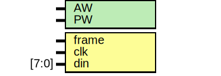

# Entity: elink_monitor

- **File**: elink_monitor.v
## Diagram

## Generics

| Generic name | Type | Value   | Description |
| ------------ | ---- | ------- | ----------- |
| AW           |      | 32      |             |
| PW           |      | 2*AW+40 |             |
## Ports

| Port name | Direction | Type  | Description |
| --------- | --------- | ----- | ----------- |
| frame     | input     |       |             |
| clk       | input     |       |             |
| din       | input     | [7:0] |             |
## Signals

| Name     | Type         | Description |
| -------- | ------------ | ----------- |
| cycle    | reg [3:0]    |             |
| read     | reg          |             |
| dstaddr  | reg [31:0]   |             |
| srcaddr  | reg [31:0]   |             |
| data     | reg [31:0]   |             |
| ctrlmode | reg [3:0]    |             |
| datamode | reg [1:0]    |             |
| burst    | reg          |             |
| access   | reg          |             |
| write    | reg          |             |
| packet   | wire [103:0] |             |
## Processes
- unnamed: ( @ (posedge clk) )
  - **Type:** always
- unnamed: ( @ (posedge clk) )
  - **Type:** always
 **Description**
Rising edge sampling 
- unnamed: ( @ (negedge clk) )
  - **Type:** always
 **Description**
 case (cycle) Falling edge sampling 
