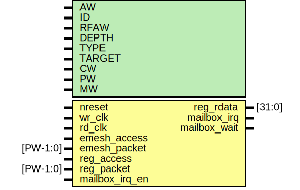

# Entity: emailbox

- **File**: emailbox.v
## Diagram

## Description

####################################################################
# Function: Mailbox FIFO with a FIFO empty/full flag interrupts.
#
#           E_MAILBOXLO    = lower 32 bits of FIFO entry
#           E_MAILBOXHI    = upper 32 bits of FIFO entry
#           E_MAILBOXSTAT  = {30'b0,fifo_full, ~fifo_empty}
#
# Notes:    1.) System should take care of not overflowing the FIFO
#           2.) Reading E_MAILBOXLO causes a fifo rd pointer update
#           3.) The "embox_not_empty" is a level interrupt signal
#           
#####################################################################

## Generics

| Generic name | Type | Value         | Description          |
| ------------ | ---- | ------------- | -------------------- |
| AW           |      | 32            |  data width of fifo  |
| ID           |      | 12'h000       |  link id             |
| RFAW         |      | 6             |  address bus width   |
| DEPTH        |      | 32            |  fifo depth          |
| TYPE         |      | "SYNC"        |  SYNC or ASYNC fifo  |
| TARGET       |      | "GENERIC"     |                      |
| CW           |      | $clog2(DEPTH) |  fifo count width    |
| PW           |      | 2*AW+40       |  packet size         |
| MW           |      | PW            |  fifo memory width   |
## Ports

| Port name      | Direction | Type     | Description                       |
| -------------- | --------- | -------- | --------------------------------- |
| nreset         | input     |          | asynchronous active low reset     |
| wr_clk         | input     |          | write clock                       |
| rd_clk         | input     |          | read clock                        |
| emesh_access   | input     |          | message access (write only)       |
| emesh_packet   | input     | [PW-1:0] | message packet                    |
| reg_access     | input     |          | register access (read only)       |
| reg_packet     | input     | [PW-1:0] | data/address                      |
| reg_rdata      | output    | [31:0]   | readback dataa                    |
| mailbox_irq_en | input     |          | interupt enable                   |
| mailbox_irq    | output    |          | interrupt                         |
| mailbox_wait   | output    |          | mailbox is at prog_full, pushback |
## Signals

| Name              | Type          | Description                                                                                                                                     |
| ----------------- | ------------- | ----------------------------------------------------------------------------------------------------------------------------------------------- |
| read_hi           | reg           | ################################################################## # BODY ##################################################################    |
| read_lo           | reg           |                                                                                                                                                 |
| read_status       | reg           |                                                                                                                                                 |
| emesh_addr        | wire [31:0]   |                                                                                                                                                 |
| emesh_din         | wire [63:0]   |                                                                                                                                                 |
| emesh_write       | wire          |                                                                                                                                                 |
| mailbox_read      | wire          |                                                                                                                                                 |
| mailbox_write     | wire          |                                                                                                                                                 |
| mailbox_data      | wire [MW-1:0] |                                                                                                                                                 |
| mailbox_empty     | wire          |                                                                                                                                                 |
| mailbox_full      | wire          |                                                                                                                                                 |
| mailbox_prog_full | wire          |                                                                                                                                                 |
| message_count     | wire [CW-1:0] |                                                                                                                                                 |
| mailbox_status    | wire [31:0]   |                                                                                                                                                 |
| reg_ctrlmode      | wire [4:0]    | From p2e1 of packet2emesh.v                                                                                                                     |
| reg_data          | wire [AW-1:0] | From p2e1 of packet2emesh.v                                                                                                                     |
| reg_datamode      | wire [1:0]    | From p2e1 of packet2emesh.v                                                                                                                     |
| reg_dstaddr       | wire [AW-1:0] | From p2e1 of packet2emesh.v                                                                                                                     |
| reg_srcaddr       | wire [AW-1:0] | From p2e1 of packet2emesh.v                                                                                                                     |
| reg_write         | wire          | From p2e1 of packet2emesh.v                                                                                                                     |
## Processes
- unnamed: ( @ (posedge rd_clk) )
  - **Type:** always
## Instantiations

- oh_mux3: oh_mux3
