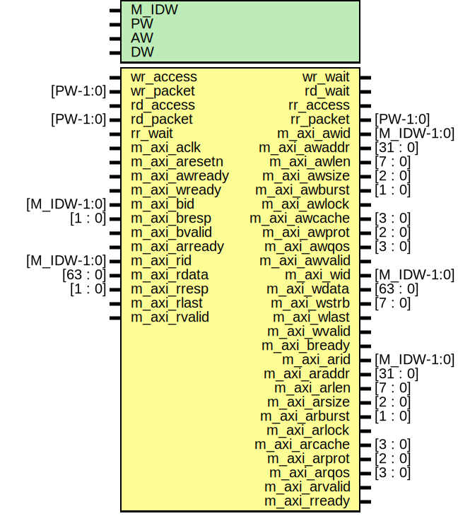

# Entity: emaxi

- **File**: emaxi.v
## Diagram

## Description

## Generics

| Generic name | Type | Value | Description |
| ------------ | ---- | ----- | ----------- |
| M_IDW        |      | 12    |             |
| PW           |      | 104   |             |
| AW           |      | 32    |             |
| DW           |      | 32    |             |
## Ports

| Port name     | Direction | Type        | Description                                                                     |
| ------------- | --------- | ----------- | ------------------------------------------------------------------------------- |
| wr_access     | input     |             | ########################EMESH INTERFACE ######################## Write request  |
| wr_packet     | input     | [PW-1:0]    |                                                                                 |
| wr_wait       | output    |             |                                                                                 |
| rd_access     | input     |             | Read request                                                                    |
| rd_packet     | input     | [PW-1:0]    |                                                                                 |
| rd_wait       | output    |             |                                                                                 |
| rr_access     | output    |             | Read response                                                                   |
| rr_packet     | output    | [PW-1:0]    |                                                                                 |
| rr_wait       | input     |             |                                                                                 |
| m_axi_aclk    | input     |             | global clock signal.                                                            |
| m_axi_aresetn | input     |             | global reset singal.                                                            |
| m_axi_awid    | output    | [M_IDW-1:0] | write address ID                                                                |
| m_axi_awaddr  | output    | [31 : 0]    | master interface write address                                                  |
| m_axi_awlen   | output    | [7 : 0]     | burst length.                                                                   |
| m_axi_awsize  | output    | [2 : 0]     | burst size.                                                                     |
| m_axi_awburst | output    | [1 : 0]     | burst type.                                                                     |
| m_axi_awlock  | output    |             | lock type                                                                       |
| m_axi_awcache | output    | [3 : 0]     | memory type.                                                                    |
| m_axi_awprot  | output    | [2 : 0]     | protection type.                                                                |
| m_axi_awqos   | output    | [3 : 0]     | quality of service                                                              |
| m_axi_awvalid | output    |             | write address valid                                                             |
| m_axi_awready | input     |             | write address ready                                                             |
| m_axi_wid     | output    | [M_IDW-1:0] | Write data channel                                                              |
| m_axi_wdata   | output    | [63 : 0]    | master interface write data.                                                    |
| m_axi_wstrb   | output    | [7 : 0]     | byte write strobes                                                              |
| m_axi_wlast   | output    |             | last transfer in a write burst.                                                 |
| m_axi_wvalid  | output    |             | indicates data is ready to go                                                   |
| m_axi_wready  | input     |             | slave is ready for data                                                         |
| m_axi_bid     | input     | [M_IDW-1:0] | Write response channel                                                          |
| m_axi_bresp   | input     | [1 : 0]     | status of the write transaction.                                                |
| m_axi_bvalid  | input     |             | channel is a valid write response                                               |
| m_axi_bready  | output    |             | master can accept write response.                                               |
| m_axi_arid    | output    | [M_IDW-1:0] | read address ID                                                                 |
| m_axi_araddr  | output    | [31 : 0]    | initial address of a read burst                                                 |
| m_axi_arlen   | output    | [7 : 0]     | burst length                                                                    |
| m_axi_arsize  | output    | [2 : 0]     | burst size                                                                      |
| m_axi_arburst | output    | [1 : 0]     | burst type                                                                      |
| m_axi_arlock  | output    |             | lock type                                                                       |
| m_axi_arcache | output    | [3 : 0]     | memory type                                                                     |
| m_axi_arprot  | output    | [2 : 0]     | protection type                                                                 |
| m_axi_arqos   | output    | [3 : 0]     | quality of service info                                                         |
| m_axi_arvalid | output    |             | valid read address                                                              |
| m_axi_arready | input     |             | slave is ready to accept an address                                             |
| m_axi_rid     | input     | [M_IDW-1:0] | read data ID                                                                    |
| m_axi_rdata   | input     | [63 : 0]    | master read data                                                                |
| m_axi_rresp   | input     | [1 : 0]     | status of the read transfer                                                     |
| m_axi_rlast   | input     |             | last transfer in a read burst                                                   |
| m_axi_rvalid  | input     |             | signaling the required read data                                                |
| m_axi_rready  | output    |             | master can accept the readback data                                             |
## Signals

| Name              | Type          | Description                                                                                                                                                                     |
| ----------------- | ------------- | ------------------------------------------------------------------------------------------------------------------------------------------------------------------------------- |
| m_axi_awaddr      | reg [31 : 0]  | ######################################################################### REGISTER/WIRE DECLARATIONS #########################################################################  |
| m_axi_awlen       | reg [7:0]     |                                                                                                                                                                                 |
| m_axi_awsize      | reg [2:0]     |                                                                                                                                                                                 |
| m_axi_awvalid     | reg           |                                                                                                                                                                                 |
| m_axi_wdata       | reg [63 : 0]  |                                                                                                                                                                                 |
| m_axi_rdata_reg   | reg [63 : 0]  |                                                                                                                                                                                 |
| m_axi_wstrb       | reg [7 : 0]   |                                                                                                                                                                                 |
| m_axi_wlast       | reg           |                                                                                                                                                                                 |
| m_axi_wvalid      | reg           |                                                                                                                                                                                 |
| awvalid_b         | reg           |                                                                                                                                                                                 |
| awaddr_b          | reg [31:0]    |                                                                                                                                                                                 |
| awsize_b          | reg [2:0]     |                                                                                                                                                                                 |
| awlen_b           | reg [7:0]     |                                                                                                                                                                                 |
| wvalid_b          | reg           |                                                                                                                                                                                 |
| wdata_b           | reg [63:0]    |                                                                                                                                                                                 |
| wstrb_b           | reg [7:0]     |                                                                                                                                                                                 |
| wdata_aligned     | reg [63 : 0]  |                                                                                                                                                                                 |
| wstrb_aligned     | reg [7 : 0]   |                                                                                                                                                                                 |
| rr_access         | reg           |                                                                                                                                                                                 |
| rr_data           | reg [31:0]    |                                                                                                                                                                                 |
| rr_srcaddr        | reg [31:0]    |                                                                                                                                                                                 |
| rr_datamode       | reg [3:0]     |                                                                                                                                                                                 |
| rr_ctrlmode       | reg [3:0]     |                                                                                                                                                                                 |
| rr_dstaddr        | reg [31:0]    |                                                                                                                                                                                 |
| m_axi_rdata_fifo  | reg [63:0]    |                                                                                                                                                                                 |
| rr_access_fifo    | reg           |                                                                                                                                                                                 |
| aw_go             | wire          | wires                                                                                                                                                                           |
| w_go              | wire          |                                                                                                                                                                                 |
| readinfo_wren     | wire          |                                                                                                                                                                                 |
| readinfo_full     | wire          |                                                                                                                                                                                 |
| readinfo_out      | wire [40:0]   |                                                                                                                                                                                 |
| readinfo_in       | wire [40:0]   |                                                                                                                                                                                 |
| awvalid_in        | wire          |                                                                                                                                                                                 |
| wr_datamode       | wire [1:0]    |                                                                                                                                                                                 |
| wr_dstaddr        | wire [AW-1:0] |                                                                                                                                                                                 |
| wr_data           | wire [DW-1:0] |                                                                                                                                                                                 |
| wr_srcaddr        | wire [AW-1:0] |                                                                                                                                                                                 |
| rd_datamode       | wire [1:0]    |                                                                                                                                                                                 |
| rd_ctrlmode       | wire [4:0]    |                                                                                                                                                                                 |
| rd_dstaddr        | wire [AW-1:0] |                                                                                                                                                                                 |
| rd_srcaddr        | wire [AW-1:0] |                                                                                                                                                                                 |
| rr_datamode_fifo  | wire [1:0]    |                                                                                                                                                                                 |
| rr_ctrlmode_fifo  | wire [3:0]    |                                                                                                                                                                                 |
| rr_dstaddr_fifo   | wire [31:0]   |                                                                                                                                                                                 |
| rr_alignaddr_fifo | wire [2:0]    |                                                                                                                                                                                 |
| packet_out        | wire [103:0]  |                                                                                                                                                                                 |
| fifo_prog_full    | wire          |                                                                                                                                                                                 |
| fifo_full         | wire          |                                                                                                                                                                                 |
| fifo_rd_en        | wire          |                                                                                                                                                                                 |
| fifo_wr_en        | wire          |                                                                                                                                                                                 |
| sync_nreset       | wire          | Rest synchronization (for safety, assume incoming reset is async)                                                                                                               |
## Processes
- unnamed: ( @( posedge m_axi_aclk ) )
  - **Type:** always
 **Description**
 generate write-address signals 
- unnamed: ( @* )
  - **Type:** always
 **Description**
 else: !if(~m_axi_aresetn) ######################################################################### Write data alignment circuit ######################################################################### 
- unnamed: ( @* )
  - **Type:** always
- unnamed: ( @ (posedge m_axi_aclk ) )
  - **Type:** always
 **Description**
 always @ * ######################################################################### Write data channel ######################################################################### 
- unnamed: ( @ (posedge m_axi_aclk) )
  - **Type:** always
 **Description**
BUG!: 1'b1 Pipeline axi transaction to account for FIFO read latency    
- unnamed: ( @ (posedge m_axi_aclk) )
  - **Type:** always
 **Description**
Alignment Mux (one cycle) 
## Instantiations

- dsync: oh_dsync
- fifo_async: oh_fifo_sync
 **Description**
Synchronous FIFO for read transactions  	 

