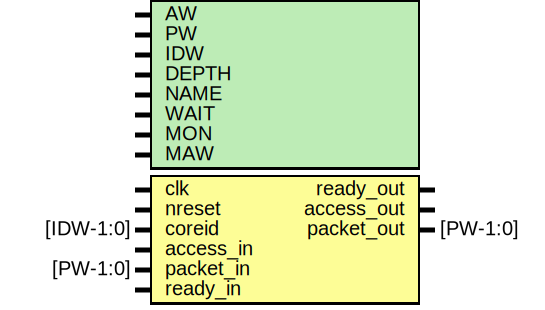

# Entity: ememory

- **File**: ememory.v
## Diagram

## Generics

| Generic name | Type | Value         | Description              |
| ------------ | ---- | ------------- | ------------------------ |
| AW           |      | 32            |  address width           |
| PW           |      | 104           |  packet width            |
| IDW          |      | 12            |  ID width                |
| DEPTH        |      | 65536         |  memory depth            |
| NAME         |      | "emem"        |  instance name           |
| WAIT         |      | 0             |  enable random wait      |
| MON          |      | 0             |  enable monitor monitor  |
| MAW          |      | $clog2(DEPTH) |                          |
## Ports

| Port name  | Direction | Type      | Description                   |
| ---------- | --------- | --------- | ----------------------------- |
| clk        | input     |           |  clk,reset                    |
| nreset     | input     |           |                               |
| coreid     | input     | [IDW-1:0] |                               |
| access_in  | input     |           |  incoming read/write          |
| packet_in  | input     | [PW-1:0]  |                               |
| ready_out  | output    |           | pushback                      |
| access_out | output    |           |  back to mesh (readback data) |
| packet_out | output    | [PW-1:0]  |                               |
| ready_in   | input     |           | pushback                      |
## Signals

| Name         | Type           | Description                                   |
| ------------ | -------------- | --------------------------------------------- |
| addr         | wire [MAW-1:0] | ############### # LOCAL WIRES ##############  |
| din          | wire [63:0]    |                                               |
| dout         | wire [63:0]    |                                               |
| en           | wire           |                                               |
| mem_rd       | wire           |                                               |
| wen          | reg [7:0]      |                                               |
| write_out    | reg            |                                               |
| datamode_out | reg [1:0]      |                                               |
| ctrlmode_out | reg [4:0]      |                                               |
| dstaddr_out  | reg [AW-1:0]   |                                               |
| srcaddr_out  | wire [AW-1:0]  |                                               |
| data_out     | wire [AW-1:0]  |                                               |
| align_addr   | reg  [2:0]     |                                               |
| din_aligned  | wire [DW-1:0]  |                                               |
| dout_aligned | wire [63:0]    |                                               |
| ready_random | wire           | TODO: make random                             |
| ready_all    | wire           |                                               |
| ctrlmode_in  | wire [4:0]     | From p2e of packet2emesh.v                    |
| data_in      | wire [AW-1:0]  | From p2e of packet2emesh.v                    |
| datamode_in  | wire [1:0]     | From p2e of packet2emesh.v                    |
| dstaddr_in   | wire [AW-1:0]  | From p2e of packet2emesh.v                    |
| srcaddr_in   | wire [AW-1:0]  | From p2e of packet2emesh.v                    |
| write_in     | wire           | From p2e of packet2emesh.v                    |
## Constants

| Name | Type | Value | Description      |
| ---- | ---- | ----- | ---------------- |
| DW   |      | AW    | always the same  |
## Processes
- unnamed: ( @* )
  - **Type:** always
 **Description**
Write mask TODO: make module 
- unnamed: ( @ (posedge  clk or negedge nreset) )
  - **Type:** always
 **Description**
Outgoing transaction      
## Instantiations

- emesh_rdalign: emesh_rdalign
 **Description**
Outputs

