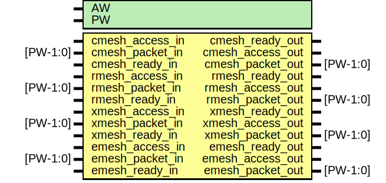

# Entity: emesh_if

- **File**: emesh_if.v
## Diagram

## Description

WARNING: Pass through logic

## Generics

| Generic name | Type | Value   | Description |
| ------------ | ---- | ------- | ----------- |
| AW           |      | 32      |             |
| PW           |      | 2*AW+40 |             |
## Ports

| Port name        | Direction | Type     | Description   |
| ---------------- | --------- | -------- | ------------- |
| cmesh_access_in  | input     |          | ##Cmesh##     |
| cmesh_packet_in  | input     | [PW-1:0] |               |
| cmesh_ready_out  | output    |          |               |
| cmesh_access_out | output    |          |               |
| cmesh_packet_out | output    | [PW-1:0] |               |
| cmesh_ready_in   | input     |          |               |
| rmesh_access_in  | input     |          | ##Rmesh##     |
| rmesh_packet_in  | input     | [PW-1:0] |               |
| rmesh_ready_out  | output    |          |               |
| rmesh_access_out | output    |          |               |
| rmesh_packet_out | output    | [PW-1:0] |               |
| rmesh_ready_in   | input     |          |               |
| xmesh_access_in  | input     |          | ##Xmesh##     |
| xmesh_packet_in  | input     | [PW-1:0] |               |
| xmesh_ready_out  | output    |          |               |
| xmesh_access_out | output    |          |               |
| xmesh_packet_out | output    | [PW-1:0] |               |
| xmesh_ready_in   | input     |          |               |
| emesh_access_in  | input     |          | ##Emesh##     |
| emesh_packet_in  | input     | [PW-1:0] |               |
| emesh_ready_out  | output    |          |               |
| emesh_access_out | output    |          | core-->io     |
| emesh_packet_out | output    | [PW-1:0] |               |
| emesh_ready_in   | input     |          |               |
